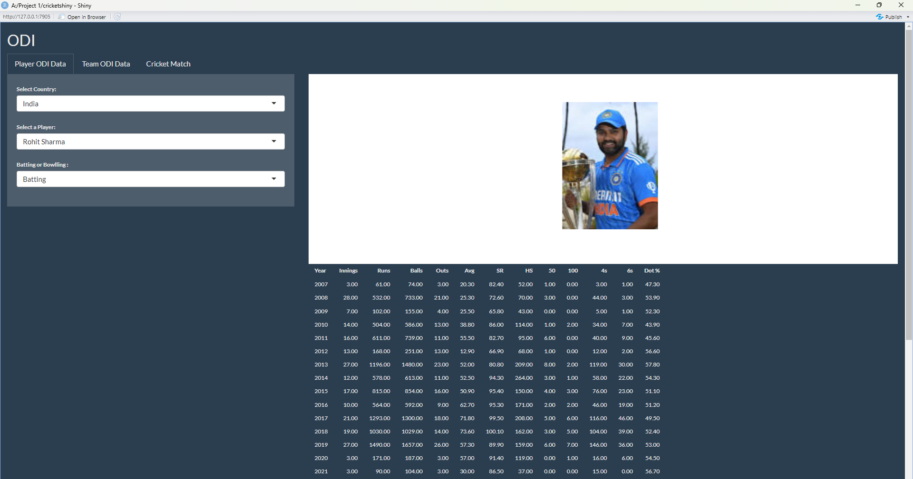
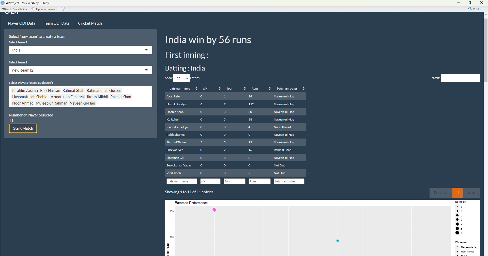
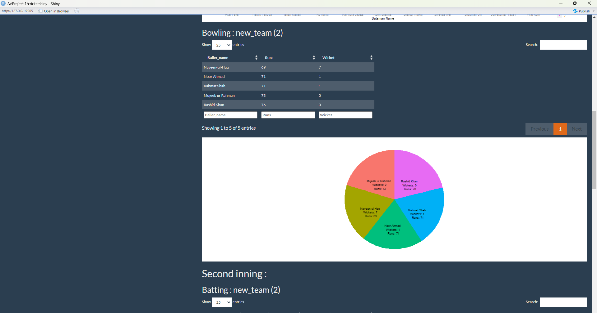

```{r}
#| echo: false
#| eval: true
#| warning: false

library(shiny)
library(ggplot2)
library(png)
library(magick)
library(shinyjs)
library(shinyalert)
library(dplyr)
library(shinythemes)
library(gt)
library(plotly)
library(rvest)

load("Data Sets/Cricket.RData")
load("Data Sets/Teams_Table.RData")
load("Data Sets/Cricket_Coord.RData")
happy <- read.csv("Data Sets/Happiness_Index.csv")
gdp <- read.csv("Data Sets/gdp_per_capita.csv")

year <- function(da) {
  return(as.integer(format(da, "%Y")))
}
```


# Introduction

This report provides a detailed analysis of the Shiny app developed for cricket player ODI data . The app is designed to allow users to interact with cricket data in a user-friendly manner, providing insights into player performance, team statistics, match simulations, and more.

## App Overview

The Shiny app consists of Three tabs, each dedicated to a specific aspect of cricket analysis. This section provides an overview of each tab's purpose and functionality.

## Data

Data for the first tab of shiny is in form of list , there are mainly two lists which are named as Player_data and Player_name . In Player_data list data which is scraped is saved in well defined format with respect to player with there country . In Player_name list all player named are saved with respect to there country . The interesting thing in data saving is that the list named are of country name and of player name and in a list there is another list i.e in Player_data list there is a list for country names and in that there is a list named after players. And the same data is used to simulate the Cricket Match .
Data for the second tab is saved in the form of an Rdata called Teams_Table.Rdata, which saves data in the form of a table called table, and a function called team_filter which collects data of all matches which are played by a certain team. That file saves the data of all matches, including the winners, losers, their scores, margins and more. Happiness_Index.csv saves the data of Happiness Index of countries from 2013 to 2023. gdp_per_capita.csv saves data of GDP per Capita of countries.

### Scraping of data 

Data for first tab that is a list witch contain batting and bowling data is scraped form a website named as Cricmatric you can go there from [here](http://www.cricmetric.com/index.py). First we formed a function and that give list to the function that is player name list then we got the data in output .Function for batting data is as follows :

```{r}
#| echo: true
#| eval: false

Scrap_Bating_data <- function(name){
  name1 <- gsub(pattern = " ", replacement = "+", name )
  link <- paste0("http://www.cricmetric.com/playerstats.py?player=",name1,"&role=batsman&format=ODI&groupby=year")

  data <- read_html(link) %>%
    html_table()
  Data <- data[[1]]
  row_number <-dim(Data)[1]
  Data$Runs <-  gsub(pattern = ",",replacement = "",x = Data$Runs)
  Data$Balls <- gsub(pattern = ",",replacement = "",x = Data$Balls)
  Data$'4s' <- gsub(pattern = ",",replacement = "",x = Data$'4s')
  
  
  
  Data$Innings <- as.numeric(Data$Innings)
  Data$Runs <- as.numeric(Data$Runs)
  Data$Balls <- as.numeric(Data$Balls)
  Data$Outs <- as.numeric(Data$Outs)
  Data$Avg <- as.numeric(Data$Avg)
  Data$SR <- as.numeric(Data$SR)
  Data$HS <- as.numeric(Data$HS)
  Data$'50' <- as.numeric(Data$'50')
  Data$'100' <- as.numeric(Data$'100')
  Data$'4s' <- as.numeric(Data$'4s')
  Data$'6s' <- as.numeric(Data$'6s')
  Data1 <- Data
  Data <- Data[-c(row_number),]
  
  Main <- Data %>%
    select(Year ,Runs ,Balls, Innings , Outs) %>%
    summarise(Year = Year ,
              Rate = round({Runs/Balls}*6, 2),
              Runs_per_Inning =Runs/Innings  , 
              Balls_per_Inning = Balls/Innings,
              Not_Out_Rate = {Innings-Outs}/Innings)
  
  xy <- Main[,c(1,3,4)]
  xy <- melt(xy,"Year")
  text <- Main$Rate
  text <- append(text,Main$Not_Out_Rate)
  text <- round(text,3)
  Data5 <- tibble(xy,text)
  ggp <- ggplot(Data5 , aes(x = Year , y = value , fill = variable )) + 
    geom_bar(stat = "identity", width = 0.5,position = position_dodge(width = 0.7)) + 
    geom_text(aes(label=text), vjust=1.5, colour="black", size=3) +
    labs(x = "Years" , y = "Number of Balls Or Runs ", title =paste0(name,"'s Performance") )
  
  
  xz  <- Data1[c(row_number),]
  Fours <- as.numeric(xz[1,11]/xz[1,4])
  Sixs <- as.numeric(xz[1,12]/xz[1,4])
  
  Fo <- as.numeric(xz[1,11])*4
  Six <- as.numeric(xz[1,12])*6
  Tot <- as.numeric(xz[1,3])
  ToB <- as.numeric(xz[1,4])
  pro <- {Tot-(Fo+Six)}/6
  
  Ones <- pro*3/ToB
  Twos <-  pro*2/ToB
  Threes <-  pro/ToB
  zeros <- 1-Ones - Twos - Threes - Fours - Sixs
  x <- NULL
  x[1] <- zeros
  x[2] <- Ones
  x[3] <- Twos
  x[4] <- Threes
  x[5] <- Fours
  x[6] <-Sixs
  output <- list(length(3))
  output[[1]] <- x
  output[[2]] <- Data
  output[[3]] <- ggp
  return(output)
  
}
```

Function for bowling data:

```{r}
#| echo: true
#| eval: false

Scrap_Bowling_data <- function(name){
  name1 <- gsub(pattern = " ", replacement = "+", name )
  link <- paste0("http://www.cricmetric.com/playerstats.py?player=",name1,"&role=bowler&format=ODI&groupby=year")
  # name <- read_html(link) %>% html_element(".panel-heading") %>% html_text2()
  data <- read_html(link) %>%
    html_table()
  Data <- data[[1]]
  row_number <- dim(Data)[1]
  Data$Runs <-  gsub(pattern = ",",replacement = "",x = Data$Runs)
  Data$Overs <- gsub(pattern = ",",replacement = "",x = Data$Overs)
  Data$'4s' <- gsub(pattern = ",",replacement = "",x = Data$'4s')
  
  Data$Innings <- as.numeric(Data$Innings)
  Data$Runs <- as.numeric(Data$Runs)
  Data$Overs <- as.numeric(Data$Overs)
  Data$Wickets <- as.numeric(Data$Wickets)
  Data$Avg <- as.numeric(Data$Avg)
  Data$SR <- as.numeric(Data$SR)
  Data$'4s' <- as.numeric(Data$'4s')
  Data$'6s' <- as.numeric(Data$'6s')
  Data1 <- Data
  Data <- Data[-c(row_number),]
  Main <- Data %>%
    select(Year ,Runs ,Overs, Innings , Wickets) %>%
    summarise(Year = Year ,
              Runs_per_Inning = round({Runs/Innings},3),
              Wickets_per_Inning_X10 =Wickets/Innings *10 , 
    )
  xy <- Main[,c(1,2,3)]
  xy <- melt(xy,"Year")
  
  ggp <- ggplot(xy , aes(x = Year , y = value , fill = variable )) + 
    geom_bar(stat = "identity", width = 0.5,position = position_dodge(width = 0.7)) + 
    labs(x = "Years" , y = "Number of Wickets Or Runs Per Year ", title =paste0(name,"'s Performance") )
  
 
  xz  <- Data1[c(row_number),]
  some <- as.numeric(xz[1,5]/xz[1,3])
  output <- list(length(3))
  output[[1]] <- some/6
  output[[2]] <- Data
  output[[3]] <- ggp
  return(output)
}
```

How the data is stored , below is the code to save data in workplace and after it data is saved in Rdata format.

```{r}
#| echo: true
#| eval: false
Team <- read_html("https://www.thecricketer.com/Topics/mens-world-cup-2023/mens_cricket_world_cup_2023_squads_all_teams_player_lists.html") %>%
  html_elements("#wl_f813f7 h3") %>%
  html_text2()


Team_Player <- read_html("https://www.thecricketer.com/Topics/mens-world-cup-2023/mens_cricket_world_cup_2023_squads_all_teams_player_lists.html") %>%
  html_elements("#wl_f813f7 p") %>%
  html_text2()

Team_Player <- Team_Player[-c(1:3,14)]

Team_Player <- gsub("[(c)]","",Team_Player)

Team_Player[1] <- "Hashmatullah Shahidi , Rahmanullah Gurbaz, Ibrahim Zadran, Riaz Hassan, Rahmat Shah, Najibullah Zadran, Mohammad Nabi, Ikram Alikhil, Azmatullah Omarzai, Rashid Khan, Mujeeb ur Rahman, Noor Ahmad, Fazalhaq Farooqi, Abdul Rahman, Naveen-ul-Haq"
Team_Player[2] <- "Pat Cummins, Sean Abbott, Alex Carey, Cameron Green, Josh Hazlewood, Travis Head, Josh Inglis, Marnus Labuschagne, Mitchell Marsh, Glenn Maxwell, Steven Smith, Mitchell Starc, Marcus Stoinis, David Warner, Adam Zampa"
Team_Player[3] <- "Shakib Al Hasan , Liton Das , Najmul Hossain Shanto, Tanzid Hasan, Towhid Hridoy, Mahmudullah, Mushfiqur Rahim, Mehidy Hasan, Mahedi Hasan, Tanzim Hasan Sakib, Nasum Ahmed, Shoriful Islam, Hasan Mahmud, Taskin Ahmed, Mustafizur Rahman"
Team_Player[4] <- "Jos Buttler , Moeen Ali, Gus Atkinson, Jonny Bairstow, Sam Curran, Liam Livingstone, Dawid Malan, Adil Rashid, Joe Root, Jason Roy, Ben Stokes, Reece Topley, David Willey, Mark Wood, Chris Woakes"
Team_Player[6] <- "SA Edwards , Max O'Dowd, Bas de Leede, Vikram Singh, Teja Nidamanuru, Paul van Meekeren, Colin Ackermann, Roelof van der Merwe, Logan van Beek, Aryan Dutt, Ryan Klein, Wesley Barresi, Saqib Zulfiqar, Shariz Ahmad, Michael Rippon"


Afghanistan <- strsplit(x =Team_Player[1] , split = ",",fixed = TRUE )
Afghanistan[[1]][15] <- "Naveen-ul-Haq"
Australia <- strsplit(x =Team_Player[2] , split = ",",fixed = TRUE )
Bangladesh <- strsplit(x =Team_Player[3] , split = ",",fixed = TRUE )
England <- strsplit(x =Team_Player[4] , split = ",",fixed = TRUE )
India <- strsplit(x =Team_Player[5] , split = ",",fixed = TRUE )
Netherlands <- strsplit(x =Team_Player[6] , split = ",",fixed = TRUE )
New_Zealand <- strsplit(x =Team_Player[7] , split = ",",fixed = TRUE )[[1]][-c(8)]
Pakistan <- strsplit(x =Team_Player[8] , split = ",",fixed = TRUE )
Pakistan[[1]][14] <- "Shaheen Shah Afridi"
Pakistan[[1]][15] <- "Usama Mir"
South_Africa <- strsplit(x =Team_Player[9] , split = ",",fixed = TRUE )
Sri_Lanka <- strsplit(x =Team_Player[10] , split = ",",fixed = TRUE )

Sri_Lanka[[1]][5]


#################################################################################
# Assuming Team and Team_Player are defined as you provided

# Create an empty list to store the team players
Country <- vector("list", length = length(Team))

# Loop through each team
for(i in seq_along(Team)) {
  team_name <- Team[i]
  players <- strsplit(Team_Player[i], ", ")[[1]]
  
  # Assign the players to the list element with the team name as the list name
  Country[[team_name]] <- players
}


###############################################################################

Player_Data<- list()

for ( i in 5:length(Team)){
  team_name <- Team[i]
  for( j in 1:15){
    print(Country[[team_name]][j])
    Player_Data[[team_name]][[Country[[team_name]][j]]][["Batting"]] <- Scrap_Bating_data(Country[[team_name]][j])
    
  }
}

```

Data stored in Teams_Table.Rdata is scraped from [Cricinfo](http://www.cricmetric.com/index.py).

```{r}
#| echo: true
#| eval: false

table <- NULL

for (i in 1971:1975) {
  print(i)
  html <- read_html(paste0("https://www.espncricinfo.com/records/year/team-match-results/", i, "-", i, "/one-day-internationals-2"))
  table1 <- html_table(html)[[1]]
  table1 <- table1 %>% filter(X1 != "Team 1")
  link <- html_elements(html, "a")
  link <- html_attr(link, "href")
  link <- unique(link)
  link <- link[substr(link, 1, 8) == "/series/"]
  table1 <- cbind(table1, paste0("https://www.espncricinfo.com", link))
  table1 <- cbind(table1, numeric(dim(table1)[1]))
  table1 <- cbind(table1, numeric(dim(table1)[1]))
  table <- rbind(table, table1)
}

colnames(table) <- c("Team 1", "Team 2", "Winner", "Margin", "Ground", "Match Date", "Scorecard", "Link", "Winner_Score", "Loser_Score")

table <- table %>% filter(Winner != "no result") %>% filter(Winner != "tied")
links <- table$Link


for (i in 1:dim(table)[1]) {
  print(i)
  html <- read_html(links[i])
  tables <- html_table(html)
  table_1 <- tables[[1]]
  table_2 <- tables[[3]]
  name <- html_elements(html, "span")
  name <- html_text(name)
  name <- unique(name)
  c1 <- table_1$R[dim(table_1)[1] - 2]
  c2 <- table_2$R[dim(table_2)[1] - 2]
  if (!is.na(as.integer(substr(table_1$R[dim(table_1)[1] - 1], 1, 1)))) {
    c1 <- table_1$R[dim(table_1)[1] - 1]
  }
  if (!is.na(as.integer(substr(table_2$R[dim(table_2)[1] - 1], 1, 1)))) {
    c2 <- table_2$R[dim(table_2)[1] - 1]
  }
  total_1 <- NULL
  total_2 <- NULL
  if (substr(c1, nchar(c1) - 1, nchar(c1) - 1) == "/") {
    total_1 <- as.integer(substr(c1, 1, which(strsplit(c1, "")[[1]] == "/") - 1))
  }
  else {
    total_1 <- as.integer(c1)
  }
  if (substr(c2, nchar(c2) - 1, nchar(c2) - 1) == "/") {
    total_2 <- as.integer(substr(c2, 1, which(strsplit(c2, "")[[1]] == "/") - 1))
  }
  else {
    total_2 <- as.integer(c2)
  }
  
  winner <- table$Winner[i]
  loser <- NULL
  if (table$`Team 1`[i] == winner) {
    loser <- table$`Team 2`[i]
  }
  else {
    loser <- table$`Team 1`[i]
  }
  ind1 <- which(name == paste0(winner, " Innings"))
  ind2 <- which(name == paste0(loser, " Innings"))
  if (ind1 < ind2) {
    table$Winner_Score[i] <- total_1
    table$Loser_Score[i] <- total_2
  }
  else {
    table$Loser_Score[i] <- total_1
    table$Winner_Score[i] <- total_2
  }
}
t1 <- table
Loser <- numeric(length(t1$`Team 1`))
for (i in 1:length(Loser)) {
  if (t1$Winner[i] == t1$`Team 1`[i]) {
    Loser[i] = t1$`Team 2`[i]
  }
  if (t1$Winner[i] == t1$`Team 2`[i]) {
    Loser[i] = t1$`Team 1`[i]
  }
}
table <- cbind(t1, Loser)
table <- table %>% select(Winner, Loser, Margin, Winner_Score, Loser_Score, Ground, `Match Date`)
mon <- month.abb

conv_date <- function(date) {
  dd <- strsplit(date, " ")[[1]]
  y <- dd[3]
  m <- which(mon == dd[1], arr.ind = TRUE)
  d <- dd[2]
  if (!(gregexpr(pattern ='-',d)[[1]][1])) {
    d <- substr(d, 1, nchar(d) - 1)
  }
  if (gregexpr(pattern ='-',d)[[1]][1]) {
    d <- substr(d, gregexpr(pattern ='-',d)[[1]][1] + 1, nchar(d) - 1)
  }
  date <- paste0(y, "/", m, "/", d)
  return(date)
}

for (i in 1:length(table$`Match Date`)) {
  table$`Match Date`[i] <- conv_date(table$`Match Date`[i])
}
table$`Match Date` <- as.Date(table$`Match Date`)

Team <- NULL
for (t in teams()) {
  tw <- t1 %>% filter(Winner == t)
  tl <- t1 %>% filter(Loser == t)
  Win <- NULL
  Win_Score <- tw$Winner_Score
  Loss_Score <- tl$Loser_Score
  Score <- append(Win_Score, Loss_Score)
  for (i in 1:length(Win_Score)) {
    Win <- append(Win, "Won")
  }
  for (i in 1:length(Loss_Score)) {
    Win <- append(Win, "Lost")
  }
  Date <- append(tw$`Match Date`, tl$`Match Date`)
  Name <- NULL
  for (i in 1:(length(Win_Score) + length(Loss_Score))) {
    Name <- append(Name, t)
  }
  dataset <- data.frame(Name, Score, Win, Date)
  Team <- rbind(Team, dataset)
}
Team <- Team %>% arrange(Date)

Winning_Innings <- NULL
for (i in 1:length(table$Margin)) {
  if ((substr(table$Margin[i], nchar(table$Margin[i]) - 6, nchar(table$Margin[i]) - 1) == "wicket") | (substr(table$Margin[i], nchar(table$Margin[i]) - 5, nchar(table$Margin[i])) == "wicket")) {
    Winning_Innings <- append(Winning_Innings, "Bowling")
  }
  else {
    Winning_Innings <- append(Winning_Innings, "Batting")
  }
}

colnames(table)[7] <- "Match Date"
table <- data.frame(table, Winning_Innings)

team_filter <- function(team) {
  table <- table %>% select(Winner, Loser, Winning_Innings, Margin, Winner_Score, Loser_Score, Ground, `Match Date`)
  table1 <- table %>% filter(Winner == team | Loser == team)
  Team_Score <- NULL
  Opp_Score <- NULL
  Opponent <- NULL
  Team <- NULL
  for (i in 1:length(table1$Loser)) {
    if (table1$Winner[i] == team) {
      Team_Score = append(Team_Score, table1$Winner_Score[i])
      Opp_Score = append(Opp_Score, table1$Loser_Score[i])
      Team <- append(Team, team)
      Opponent = append(Opponent, table1$Loser[i])
    }
    if (table1$Loser[i] == team) {
      Team_Score = append(Team_Score, table1$Loser_Score[i])
      Opp_Score = append(Opp_Score, table1$Winner_Score[i])
      Team <- append(Team, team)
      Opponent = append(Opponent, table1$Winner[i])
    }
  }
  table1 <- cbind(table1, Team_Score, Opp_Score, Team, Opponent) %>% select(Team, Opponent, Team_Score, Opp_Score, Winner, Loser, Winner_Score, Loser_Score, Winning_Innings, Margin, Ground, 'Match Date')
  return(table1)
}

```


## Player ODI Data

This tab allows users to explore individual player statistics for One Day International (ODI) matches. Users can select a country, choose a player, and specify whether they want to view batting or bowling statistics.



-   **Country Selection**: Users can choose a country from a dropdown menu.

-   **Player Selection**: Once a country is selected, users can choose a player from a dynamically generated list of players for that country.

-   **Batting/Bowling Selection**: Users can select whether they want to view batting or bowling statistics.

-   **Player Image**: An image of the selected player is displayed.

-   **Player Data Table**: Detailed statistics of the selected player are presented in a table format. This will be like:-

```{r}
#| echo: false
#| eval: true
#| warning: false
Player_Data$India$`Virat Kohli`$Batting[2]
```

-   **Player Performance Plot**: A plot visualizing the player's performance is displayed. Like this :-

```{r}
#| echo: false
#| eval: true
Player_Data$India$`Virat Kohli`$Batting[3]
```

## Team ODI Data

### World View

This sub-tab provides a global perspective of ODI match outcomes. Users can adjust the year range to view trends over time.

-   **Year Selection Slider**: Users can adjust the range of years they want to analyze.
-   **World Map Plot**: Users can visualise the Win to Loss Ratio of each team, color coded, in a time frame.

```{r}
#| echo: false
#| eval: true
#| warning: false
teams <- unique(table$Loser)[c(1:6, 8:19, 24:28)]
W_L <- NULL
t <- table %>% filter((year(`Match Date`) >= 1971) & (year(`Match Date`) <= 2023))
for (i in 1:length(teams)) {
  win <- sum(t$Winner == teams[i])
  loss <- sum(t$Loser == teams[i])
  if (loss == 0) {
    W_L <- append(W_L, NA)
  }
  else {
    W_L <- append(W_L, win/loss)
  }
}
WL <- data.frame(teams, W_L)
data <- left_join(coord, WL, by = "teams")
ggplot(data, aes(x = long, y = lat, group = group)) + geom_polygon(aes(fill = W_L), color = "black")
```


-   **Table**: Users can see Win to Loss Ratio of all teams who have played ODI cricket in the specified timeframe.

```{r}
#| echo: false
#| eval: true

teams <- unique(table$Loser)[c(1:6, 8:19, 24:28)]
W_L <- NULL
t <- table %>% filter((year(`Match Date`) >= 1971) & (year(`Match Date`) <= 2023))
for (i in 1:length(teams)) {
  win <- sum(t$Winner == teams[i])
  loss <- sum(t$Loser == teams[i])
  if (loss == 0) {
    W_L <- append(W_L, NA)
  }
  else {
    W_L <- append(W_L, win/loss)
  }
}
WL <- data.frame(teams, W_L)
colnames(WL)[1] <- "Teams"
colnames(WL)[2] <- "Win to Loss Ratio"
x <- as_tibble(WL %>% arrange(desc(W_L)) %>% filter(!is.na(W_L)))
x
```


### Team Overview

This sub-tab allows users to select a specific team and view a summary of their performance over selected years.

-   **Team Selection Dropdown**: Users can choose their ODI team from a dropdown menu.
-   **Year Range Slider**: Users can specify the range of years they want to analyze.
     {width="400"}

-   **Team Summary**: 
```{r}
#| echo: false
#| eval: true

t <- team_filter("Australia")
t1 <- (t %>% filter((as.integer(year(t$'Match Date')) >= 1971) & (as.integer(year(t$'Match Date')) <= 2023)))
colnames(t1)[3] <- paste0("Australia Score")
colnames(t1)[4] <- "Opponent Score"
colnames(t1)[7] <- "Winning Score"
colnames(t1)[8] <- "Losing Score"
t1 <- t1[c(3, 4, 7, 8, 12)]
summary(t1)
```

-   **Head-to-Head Table**: Users can see how the selected teams performs against other teams.
```{r}
#| echo: false
#| eval: true
t2 <- team_filter("Australia")
team <- "Australia"
t <- t2 %>% filter((as.integer(year(t2$'Match Date')) >= 1971) & (as.integer(year(t2$'Match Date')) <= 2023))
Team <- unique(t$Opponent)
other <- Team
Won <- NULL
Lost <- NULL
Won_Bat <- NULL
Won_Bowl <- NULL
Lost_Bat <- NULL
Lost_Bowl <- NULL
for (i in 1:length(other)) {
  t1 <- t %>% filter(Opponent == other[i])
  Won <- append(Won, length((t1 %>% filter(Winner == team))$Winner))
  Won_Bat <- append(Won_Bat, length((t1 %>% filter((Winner == team) & (Winning_Innings == "Batting")))$Winner))
  Won_Bowl <- append(Won_Bowl, length((t1 %>% filter((Winner == team) & (Winning_Innings == "Bowling")))$Winner))
  Lost_Bat <- append(Lost_Bat, length((t1 %>% filter((Winner == other[i]) & (Winning_Innings == "Bowling")))$Winner))
  Lost_Bowl <- append(Lost_Bowl, length((t1 %>% filter((Winner == other[i]) & (Winning_Innings == "Batting")))$Winner))
  Lost <- append(Lost, length((t1 %>% filter(Winner == other[i]))$Winner))
}
    
d <- data.frame(Team, Won_Bat, Lost_Bat, Won_Bowl, Lost_Bowl, Won/Lost)
colnames(d)[6] <- "W_L Ratio"
d$'W_L Ratio'[is.infinite(d$'W_L Ratio')] <- NA
d$'W_L Ratio' <- as.double(d$'W_L Ratio')
d <- d %>% arrange(desc(d$'W_L Ratio'))
colnames(d)[6] <- "Win to Loss Ratio"
d <- gt(d)
tab <- tab_spanner(d, label = "Batting", columns = ends_with("Bat"))
tab <- tab_spanner(tab, label = "Chasing", columns = ends_with("Bowl"))
tab |> cols_label(starts_with("Won") ~ "Won", starts_with("Lost") ~ "Lost")
```
     

### Match Up

This sub-tab enables users to compare the performance of two selected teams over a specified year range.

-   **Team 1 Selection Dropdown**: Users can choose the first team from a dropdown menu.
-   **Team 2 Selection Dropdown**: Users can choose the second team from a dropdown menu.
-   **Year Range Slider**: Users can specify the range of years they want to analyze.
-   **Match Summary**: A summary of the matches when the two teams are playing each other.
```{r}
#| echo: false
#| eval: true

t <- team_filter("Australia") %>% filter(Opponent == "England")
t <- t %>% filter((year(`Match Date`) >= 1971) & (year(`Match Date`) <= 2023))
colnames(t)[3] <- paste0("Australia Score")
colnames(t)[4] <- paste0("England Score")
colnames(t)[7] <- "Winning Score"
colnames(t)[8] <- "Losing Score"
t <- t[c(3, 4, 7, 8, 12)]
summary(t)
```
     
-   **Match Up Plot**: Users can see a plot of how the teams score when playing one another.
```{r}
#| echo: false
#| eval: true

y1 <- 1971
y2 <- 2023
t1 <- "Australia"
t2 <- "England"
tf <- team_filter(t1)
tab <- tf %>% filter((as.integer(year(tf$'Match Date')) <= y2) & (as.integer(year(tf$'Match Date')) >= y1)) %>% filter(Opponent == t2)
Date <- NULL
Score <- NULL
Team <- NULL
    
for (i in 1:length(tab$Winner)) {
  if (tab$Winner[i] == t1) {
    Date <- append(Date, tab$'Match Date'[i])
    Date <- append(Date, tab$'Match Date'[i])
    Score <- append(Score, tab$Winner_Score[i])
    Score <- append(Score, tab$Loser_Score[i])
    Team <- append(Team, t1)
    Team <- append(Team, t2)
  }
  if (tab$Winner[i] == t2) {
    Date <- append(Date, tab$'Match Date'[i])
    Date <- append(Date, tab$'Match Date'[i])
    Score <- append(Score, tab$Loser_Score[i])
    Score <- append(Score, tab$Winner_Score[i])
    Team <- append(Team, t1)
    Team <- append(Team, t2)
  }
}
t <- data.frame(Date, Score, Team)
ggplot(t, aes(x = Date, y = Score, col = Team)) + geom_point()
```
     

### Happiness Index

This sub-tab provides insights into the correlation between a country's happiness index and its cricket team's performance.

-   **General View**: This view is to show the correlation of Happiness Index with the Win to Loss Ratio of the selected countries.
      {width="400"}
```{r}
#| echo: false
#| eval: true
Countries <- c("Australia", "Pakistan", "New Zealand", "India", "Sri Lanka", "Zimbabwe", "Bangladesh", "South Africa", "Netherlands", "Kenya", "Ireland", "Afghanistan")
Correlation <- NULL
for (c in Countries) {
  tab <- happy %>% filter(Country == c)
  Tf <- team_filter(c)
  y_team <- unique(year(Tf$'Match Date'))
  Year <- NULL
  for (i in unique(tab$Year)) {
    if (i %in% unique(year(Tf$'Match Date'))) {
      Year <- append(Year, i)
    }
  }
  Happiness <- NULL
  Win_To_Loss <- NULL
  for (i in Year) {
    hap <- tab$Index[which(tab$Year == i, arr.ind = TRUE)]
    Happiness <- append(Happiness, as.double(hap))
    Win <- length((Tf %>% filter(Winner == c) %>% filter(year(`Match Date`) == i))$Winner)
    Loss <- length((Tf %>% filter(Loser == c) %>% filter(year(`Match Date`) == i))$Loser)
    if (Loss == 0) {
      Win_To_Loss <- append(Win_To_Loss, Win)
    }
    else {
      Win_To_Loss <- append(Win_To_Loss, Win/Loss)
    }
  }
  Correlation <- append(Correlation, cor(Win_To_Loss, Happiness))
}
barplot(names = Countries, height = Correlation, xlab = "Countries", ylab = "Correlation")
```
      
-   **Country-Specific View**: This view can be used to visualise the variation of Happiness Index and Win to Loss Ratio of the selected country with year.

    {width="400"}
```{r}
#| echo: false
#| eval: true

y1 <- happy %>% filter(Country == "India")
y2 <- team_filter("India")
Year <- NULL
for (i in unique(y1$Year)) {
  if (i %in% unique(year(y2$'Match Date'))) {
    Year <- append(Year, i)
  }
}
Win_To_Loss <- NULL
Happiness <- NULL
for (i in Year) {
  hap <- y1$Index[which(y1$Year == i, arr.ind = TRUE)]
  Happiness <- append(Happiness, as.double(hap))
  Win <- length((y2 %>% filter(Winner == "India") %>% filter(year(`Match Date`) == i))$Winner)
  Loss <- length((y2 %>% filter(Loser == "India") %>% filter(year(`Match Date`) == i))$Loser)
  if (Loss == 0) {
    Win_To_Loss <- append(Win_To_Loss, Win)
  }
  else {
    Win_To_Loss <- append(Win_To_Loss, Win/Loss)
  }
}
matplot(Year, cbind(Happiness, Win_To_Loss), col = c("red", "blue"), pch = c(13, 16), xlab = "Year", ylab = "Happiness Index + Win To Loss Ratio")
legend("topright", legend = c("Happiness Index", "Win To Loss Ratio"), col = c("red", "blue"), pch = c(13, 16))
```
    

### GDP

This sub-tab explores the correlation between a country's Gross Domestic Product (GDP) and its cricket team's performance.

-   **General View**: This view is to show the correlation of GDP with the Win to Loss Ratio of the selected countries.

      {width="400"}
```{r}
#| echo: false
#| eval: true
Countries <- c("Australia", "Pakistan", "New Zealand", "India", "Sri Lanka", "Zimbabwe", "Bangladesh", "South Africa", "Netherlands", "Kenya", "Ireland", "Afghanistan")
Correlation <- NULL
for (c in Countries) {
  tab <- gdp %>% filter(Country.Name == c)
  Tf <- team_filter(c)
  y_team <- unique(year(Tf$'Match Date'))
  Years <- NULL
  for (i in 1960:2020) {
    if (!is.na(tab[i - 1957] == "NA") & (as.integer(i) %in% y_team)) {
      Years <- append(Years, as.integer(i))
    }
  }
  GDP <- NULL
  Win_To_Loss <- NULL
  for (i in Years) {
    GDP <- append(GDP, as.integer(tab[i - 1957]))
    Win <- length((Tf %>% filter(Winner == c) %>% filter(year(`Match Date`) == i))$Winner)
    Loss <- length((Tf %>% filter(Loser == c) %>% filter(year(`Match Date`) == i))$Loser)
    if (Loss == 0) {
      Win_To_Loss <- append(Win_To_Loss, Win)
    }
    else {
      Win_To_Loss <- append(Win_To_Loss, Win/Loss)
    }
  }
  Correlation <- append(Correlation, cor(Win_To_Loss, GDP))
}
barplot(names = Countries, height = Correlation, xlab = "Countries", ylab = "Correlation")
```
      

-   **Country-Specific View**: This view can be used to visualise the variation of GDP and Win to Loss Ratio of the selected country with year.

    {width="400"}

```{r}
#| echo: false
#| eval: true

t1 <- "India"
tab <- gdp %>% filter(Country.Name == t1)
Tf <- team_filter(t1)
y_team <- unique(year(Tf$'Match Date'))
Years <- NULL
for (i in 1960:2020) {
  if (!is.na(tab[i - 1957] == "NA") & (as.integer(i) %in% y_team)) {
    Years <- append(Years, as.integer(i))
  }
}
GDP <- NULL
Win_To_Loss <- NULL
for (i in Years) {
  GDP <- append(GDP, as.integer(tab[i - 1957]))
  Win <- length((Tf %>% filter(Winner == t1) %>% filter(year(`Match Date`) == i))$Winner)
  Loss <- length((Tf %>% filter(Loser == t1) %>% filter(year(`Match Date`) == i))$Loser)
  if (Loss == 0) {
    Win_To_Loss <- append(Win_To_Loss, Win)
  }
  else {
    Win_To_Loss <- append(Win_To_Loss, Win/Loss)
  }
}
matplot(Years, cbind(GDP, 1000*Win_To_Loss), col = c("red", "blue"), pch = c(13, 16), xlab = "Years", ylab = "GDP + Win To Loss Ratio(x 1000)")
legend("topright", legend = c("GDP per Capita", "Win To Loss Ratio(x 1000)"), col = c("red", "blue"), pch = c(13, 16))
```
   

## Cricket Match

This tab allows users to simulate a cricket match between two teams. Users can select existing teams or create custom teams by choosing players.

{width="500"}

{width="500"}

-   **Team Selection**: Users can choose existing teams or create new teams by selecting players.
-   **Player Selection**: Users can select players for the teams.
-   **Start Match Button**: Initiates the match simulation.
-   **Match Outcome**: Displays the results of the simulated match, including scores, batting, and bowling performances.Outcome will be of batting data table and there visualisation as follows :-

```{r}
#| echo: false
#| eval: true
data <- Cricket_Match(Player_Data$Afghanistan,Player_Data$India,Player_name$Afghanistan,Player_name$India)
data
```

```{r}
#| echo: false
#| eval: true
 p <-  ggplot(data[[1]][[1]], aes(x = batsman_name, y = Runs, col = factor(four), size = six , shape = batsman_outer)) + 
        geom_point() + 
        labs(title ="Batsman Performance" ,x = "Batsman Name", y = "Total Runs", 
             shape = "Wicketeer", color = "No of Four", size = "No of Six") +
        theme(axis.text.x = element_text(angle = 45, hjust = 1),legend.position = "none")
      ggplotly(p, tooltip = c("batsman_name", "Runs", "four", "six", "batsman_outer"))
```

```{r}
#| echo: false
#| eval: true
  ggplot(data[[1]][[2]], aes(x = "", y = Runs, fill = Baller_name)) +
        geom_bar(width = 1, stat = "identity", color = "black") +
        geom_text(aes(label = paste(Baller_name, "\n", "Wickets:", Wicket,"\n","Runs:" , Runs)), 
                  position = position_stack(vjust = 0.5), size = 3, vjust = 1, color = "white") +
        coord_polar("y") +
        theme_minimal() +  # Change the theme to minimal
        theme(
          legend.position = "none",
          axis.text.x = element_blank(),  # Remove x-axis text
          panel.grid = element_blank(),   # Remove grid lines
          plot.background = element_rect(fill = "lightblue"),  # Change plot background color
          panel.background = element_rect(fill = "white"),     # Change panel background color
          axis.line = element_line(color = "black"),           # Add a border around the plot
          plot.title = element_text(hjust = 0.5, size = 16),   # Center the title and increase font size
          axis.title = element_text(size = 1),                # Increase axis label font size
          axis.text.y = element_text(size = 10)    )            # Increase y-axis text font size
```

# Code Evaluation

The R code for the Shiny app demonstrates proficiency in utilizing the Shiny package, data manipulation, and visualization techniques. The app's functionality is well-organized, allowing for seamless interaction with the cricket data. You can find codes here.[Click here](https://github.com/dootika/class-project-group_22)

## Interesting data-driven questions to think about

-   What is the correlation between a country's performance and its GDP and its Happiness index?

-   Can i get a visual representations of data using graphs and chart?

-   Can I view a team's recent performance statistics, such as recent form and trends?

-   How can I access a summary of each previous encounter between two sides in the app?

-   Can I filter match history by specific teams, years, or tournaments?

-   Is there a feature to watch or re-enact classic matches from the past?

-   Can I find the win-loss ratio for different countries participating in the ODI World Cup?

-   Are historical statistics and records available for past World Cup tournaments?

-   Can I choose between default teams or create a custom team with my favorite players?

-   What level of control and customization is available during the match simulation?


# Conclusion

Access to individual player information throughout their career is a fantastic feature, especially for cricket fans who want to dig deep into player statistics and achievements. This can improve the overall cricketing experience. The ability to run live simulations with default teams or custom lineups is an appealing feature. It allows users to test strategies, create dream teams, and experience the excitement of live matches within the app. Displaying win-loss ratios for different countries in the ODI World Cup adds a competitive element to the app. Users can compare their customized team's performance to that of real-world national teams. Being capable to access summaries of previous encounters between two sides provides historical context. It allows users to research rivalries and historical events in cricket. Viewing a team's past performance, along with graphs, is a useful feature for those interested in in-depth analysis. It enables users to make data-driven decisions and understand team trends. It's interesting to see the correlation between GDP per capita, Happiness Index, and win-loss ratios of World Cup countries. It gives the app an educational and analytical dimension, appealing to users who are interested in the broader societal impact on sports performance.
