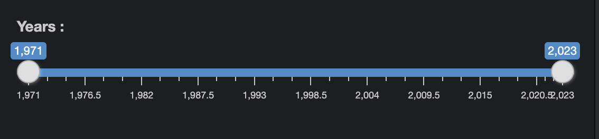
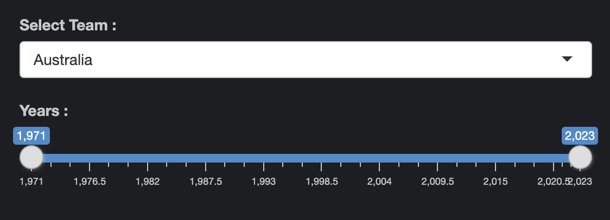
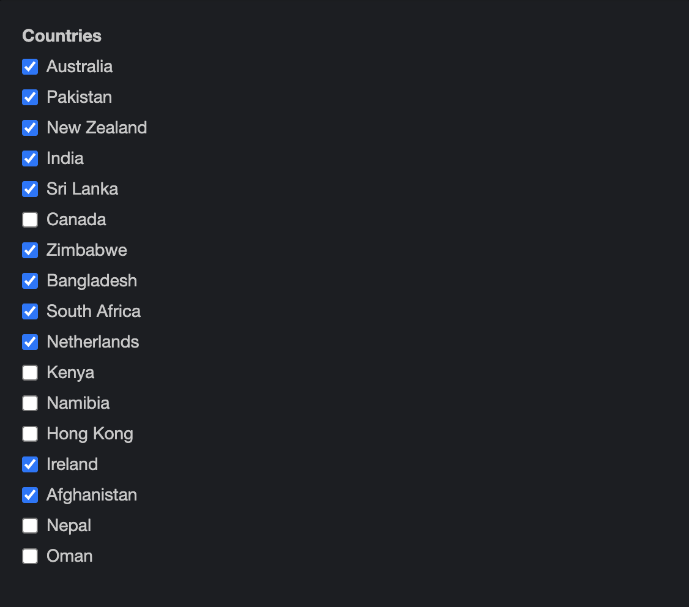
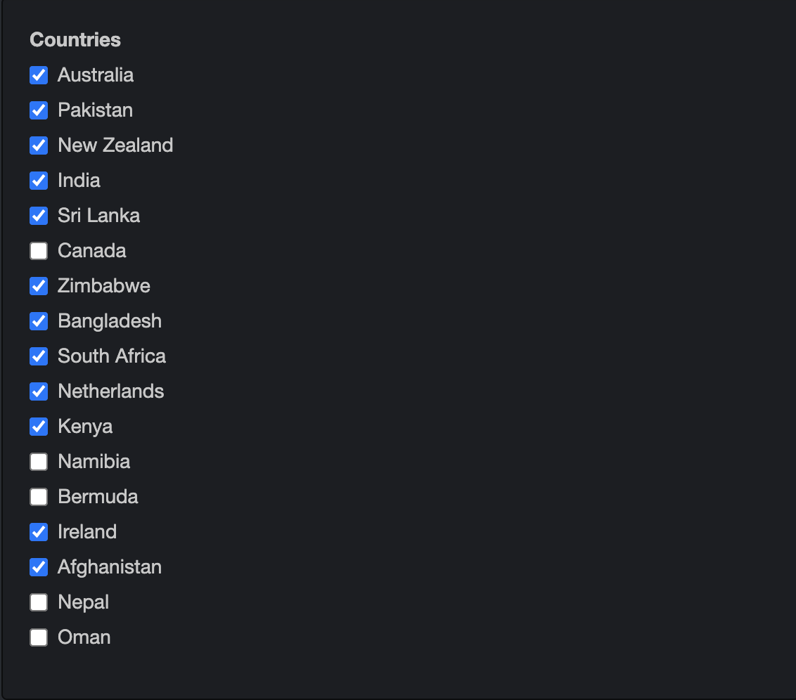
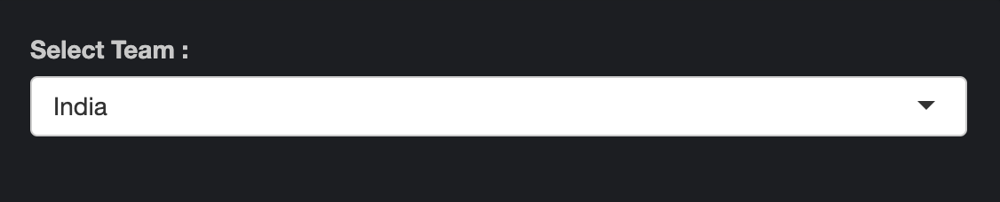

```{r}
#| echo: false
#| eval: true
#| warning: false

library(shiny)
library(ggplot2)
library(png)
library(magick)
library(shinyjs)
library(shinyalert)
library(dplyr)
library(shinythemes)
library(gt)
library(rvest)
library(dplyr)
library(tidyverse)

# Loading the required datasets

load("Data Sets/Cricket.RData")
load("Data Sets/Teams_Table.RData")
load("Data Sets/Cricket_Coord.RData")
happy <- read.csv("Data Sets/Happiness_Index.csv")
gdp <- read.csv("Data Sets/gdp_per_capita.csv")

# A year function to find the year in the Date Format.

year <- function(da) {
  return(as.integer(format(da, "%Y")))
}
```

# Introduction

This report provides a detailed analysis of the Shiny app developed for cricket player ODI data .The app is designed to allow users to interact with cricket data in a user-friendly manner, providing insights into player performance, team statistics, match simulations, and more.

## Data

Data for the first tab of shiny is in form of list , there are mainly two lists which are named as Player_data and Player_name . In Player_data list data which is scraped is saved in well defined format with respect to player with there country . In Player_name list all player named are saved with respect to there country . The interesting thing in data saving is that the list named are of country name and of player name and in a list there is another list i.e in Player_data list there is a list for country names and in that there is a list named after players. And the same data is used to simulate the Cricket Match . Data for the second tab is saved in the form of an Rdata called Teams_Table.Rdata, which saves data in the form of a table called table, and a function called team_filter which collects data of all matches which are played by a certain team. That file saves the data of all matches, including the winners, losers, their scores, margins and more. Happiness_Index.csv saves the data of Happiness Index of countries from 2013 to 2023. gdp_per_capita.csv saves data of GDP per Capita of countries.

### Scraping of data

Data for first tab that is a list which contain batting and bowling data is scraped form a website called [Cricmetric](http://www.cricmetric.com/index.py). First we formed a function and that give list to the function that is player name list then we got the data in output. Function for batting data can be seen by clicking [here](https://github.com/dootika/class-project-group_22/blob/main/Functions/batting%20scrap%20function.R) and for bowling data click [here](https://github.com/dootika/class-project-group_22/blob/main/Functions/scrap%20bowling%20data%20function.R) and for how we combine data in a list to see click [here](https://github.com/dootika/class-project-group_22/blob/main/Functions/how_list_formed.R).

Data stored in Teams_Table.Rdata is scraped from [Cricinfo](http://www.cricmetric.com/index.py) and can be seen by clicking [here](https://github.com/dootika/class-project-group_22/blob/main/Functions/Teams_Data.R). We save the table containing the ODI Matches data, along with a function team_filter, which filters out data of matches played by selected team.

First of all we scraped different team's ODI data using the following code -

```{r}
#| echo: true
#| eval: false
#| warning: false

# This is to scrape ODI data from Cricinfo year wise.

table <- NULL
for (i in 1971:2023) {
  print(i)
  html <- read_html(paste0("https://www.espncricinfo.com/records/year/team-match-results/", i, "-", i, "/one-day-internationals-2"))
  table1 <- html_table(html)[[1]]
  table1 <- table1 %>% filter(X1 != "Team 1")
  link <- html_elements(html, "a")
  link <- html_attr(link, "href")
  link <- unique(link)
  link <- link[substr(link, 1, 8) == "/series/"]
  table1 <- cbind(table1, paste0("https://www.espncricinfo.com", link))
  table1 <- cbind(table1, numeric(dim(table1)[1]))
  table1 <- cbind(table1, numeric(dim(table1)[1]))
  table <- rbind(table, table1)
}

colnames(table) <- c("Team 1", "Team 2", "Winner", "Margin", "Ground", "Match Date",
"Scorecard", "Link", "Winner_Score", "Loser_Score")

# This is to remove all matches, which were Draws or Ties.
This does not allow us to scrape data of the World Cup 2019 finals.
However, we add this data separately in the end.

table <- table %>% filter(Winner != "no result") %>% filter(Winner != "tied") %>% filter(Margin != "-")
links <- table$Link

# We go to the site containing the scorecard of each individual match,
to scrape the scores of each team, and the winner, using the link in the previously scraped table.

for (i in 1:dim(table)[1]) {
  print(i)
  html <- read_html(links[i])
  tables <- html_table(html)
  table_1 <- tables[[1]]
  table_2 <- tables[[3]]
  name <- html_elements(html, "span")
  name <- html_text(name)
  name <- unique(name)
  c1 <- table_1$R[dim(table_1)[1] - 2]
  c2 <- table_2$R[dim(table_2)[1] - 2]
  if (!is.na(as.integer(substr(table_1$R[dim(table_1)[1] - 1], 1, 1)))) {
    c1 <- table_1$R[dim(table_1)[1] - 1]
  }
  if (!is.na(as.integer(substr(table_2$R[dim(table_2)[1] - 1], 1, 1)))) {
    c2 <- table_2$R[dim(table_2)[1] - 1]
  }
  total_1 <- NULL
  total_2 <- NULL
  if (substr(c1, nchar(c1) - 1, nchar(c1) - 1) == "/") {
    total_1 <- as.integer(substr(c1, 1, which(strsplit(c1, "")[[1]] == "/") - 1))
  }
  else {
    total_1 <- as.integer(c1)
  }
  if (substr(c2, nchar(c2) - 1, nchar(c2) - 1) == "/") {
    total_2 <- as.integer(substr(c2, 1, which(strsplit(c2, "")[[1]] == "/") - 1))
  }
  else {
    total_2 <- as.integer(c2)
  }
  
  winner <- table$Winner[i]
  loser <- NULL
  if (table$`Team 1`[i] == winner) {
    loser <- table$`Team 2`[i]
  }
  else {
    loser <- table$`Team 1`[i]
  }
  ind1 <- which(name == paste0(winner, " Innings"))
  ind2 <- which(name == paste0(loser, " Innings"))
  if (ind1 < ind2) {
    table$Winner_Score[i] <- total_1
    table$Loser_Score[i] <- total_2
  }
  else {
    table$Loser_Score[i] <- total_1
    table$Winner_Score[i] <- total_2
  }
}

# We use this to determine the team which lost the match.
t1 <- table
Loser <- numeric(length(t1$`Team 1`))
for (i in 1:length(Loser)) {
  if (t1$Winner[i] == t1$`Team 1`[i]) {
    Loser[i] = t1$`Team 2`[i]
  }
  if (t1$Winner[i] == t1$`Team 2`[i]) {
    Loser[i] = t1$`Team 1`[i]
  }
}

table <- cbind(t1, Loser)
table <- table %>% select(Winner, Loser, Margin, Winner_Score, Loser_Score, Ground,
`Match Date`)

mon <- month.abb

# This is to convert the Match Date of the table to a usable form,
such that it can be converted to Date type in R.

conv_date <- function(date) {
  dd <- strsplit(date, " ")[[1]]
  y <- dd[3]
  m <- which(mon == dd[1], arr.ind = TRUE)
  d <- dd[2]
  if (!(gregexpr(pattern ='-',d)[[1]][1])) {
    d <- substr(d, 1, nchar(d) - 1)
  }
  if (gregexpr(pattern ='-',d)[[1]][1]) {
    d <- substr(d, gregexpr(pattern ='-',d)[[1]][1] + 1, nchar(d) - 1)
  }
  date <- paste0(y, "/", m, "/", d)
  return(date)
}

for (i in 1:length(table$`Match Date`)) {
  table$`Match Date`[i] <- conv_date(table$`Match Date`[i])
}

# This is the Tied World Cup Finals, which we are adding separately.

v <- c("England", "New Zealand", "0 runs", 241, 241, "Lord's", "2019-07-14",
"Bowling")
table <- rbind(table, v)
table$`Match Date` <- as.Date(table$`Match Date`)


# This is to determine which team won, based on which innings it played.

Winning_Innings <- NULL
for (i in 1:length(table$Margin)) {
  if ((substr(table$Margin[i], nchar(table$Margin[i]) - 6, nchar(table$Margin[i]) - 1) == "wicket") | (substr(table$Margin[i], nchar(table$Margin[i]) - 5, nchar(table$Margin[i])) == "wicket")) {
    Winning_Innings <- append(Winning_Innings, "Bowling")
  }
  else {
    Winning_Innings <- append(Winning_Innings, "Batting")
  }
}

colnames(table)[7] <- "Match Date"
table <- data.frame(table, Winning_Innings)
table[4491, 7] <- as.Date("2019-07-14")

# This function filters out matches played by a certain team selected.

team_filter <- function(team) {
  table <- table %>% select(Winner, Loser, Margin, Winning_Innings, Winner_Score,
  Loser_Score, Ground, `Match Date`)
  table1 <- table %>% filter(Winner == team | Loser == team)
  Team_Score <- NULL
  Opp_Score <- NULL
  Opponent <- NULL
  Team <- NULL
  for (i in 1:length(table1$Loser)) {
    if (table1$Winner[i] == team) {
      Team_Score = append(Team_Score, table1$Winner_Score[i])
      Opp_Score = append(Opp_Score, table1$Loser_Score[i])
      Team <- append(Team, team)
      Opponent = append(Opponent, table1$Loser[i])
    }
    if (table1$Loser[i] == team) {
      Team_Score = append(Team_Score, table1$Loser_Score[i])
      Opp_Score = append(Opp_Score, table1$Winner_Score[i])
      Team <- append(Team, team)
      Opponent = append(Opponent, table1$Winner[i])
    }
  }
  table1 <- cbind(table1, Team_Score, Opp_Score, Team, Opponent) %>% select(Team,
  Opponent, Winning_Innings, Team_Score, Opp_Score, Winner, Loser, Winner_Score,
  Loser_Score, Margin, Ground, 'Match Date')
  table1$Winner_Score <- as.integer(table1$Winner_Score)
  table1$Loser_Score <- as.integer(table1$Loser_Score)
  table1$Team_Score <- as.integer(table1$Team_Score)
  table1$Opp_Score <- as.integer(table1$Opp_Score)
  return(table1)
}
colnames(table)[7] <- "Match Date"
table <- table %>% arrange(table$`Match Date`)
save(table, team_filter, file = "Data Sets/Teams_Table.Rdata")

```

We also use this code to update the Team ODI Dataset, which instead of collecting the whole table again, checks if Cricinfo has added more matches, and only adds the new matches.

```{r}
#| echo: true
#| eval: false
#| warning: false

load(file = "Data Sets/Teams_Table.Rdata")
table2 <- NULL

# Again, scrapes the data from Cricinfo.

for (i in 1971:2023) {
  print(i)
  html <- read_html(paste0("https://www.espncricinfo.com/records/year/team-match-results/", i, "-", i, "/one-day-internationals-2"))
  table1 <- html_table(html)[[1]]
  table1 <- table1 %>% filter(X1 != "Team 1")
  link <- html_elements(html, "a")
  link <- html_attr(link, "href")
  link <- unique(link)
  link <- link[substr(link, 1, 8) == "/series/"]
  table1 <- cbind(table1, paste0("https://www.espncricinfo.com", link))
  table1 <- cbind(table1, numeric(dim(table1)[1]))
  table1 <- cbind(table1, numeric(dim(table1)[1]))
  table2 <- rbind(table2, table1)
}
colnames(table2) <- c("Team 1", "Team 2", "Winner", "Margin", "Ground",
"Match Date", "Scorecard", "Link", "Winner_Score", "Loser_Score")

table2 <- table2 %>% filter(Winner != "no result") %>% filter(Winner != "tied") %>% filter(Margin != "-")
table2 <- rbind(c("England", "New Zealand", "England", "0 runs", "Lord's", "2019-07-14", "Scorecard", "Link", 241, 241), table2)

d1 <- dim(table)[1]
d2 <- dim(table2)[1]

# Checks if any new matches have been played since we last scraped.
If no, then it stops. If yes, it adds only the new matches, similar to the original scrape code.

if (d1 == d2) {
  stop("No new data.")
}
table2 <- table2[c(d1 + 1: d2),]
table2 <- table2 %>% filter(!is.na(table2$`Team 1`))
links <- table2$Link

for (i in 1:dim(table2)[1]) {
  print(i)
  html <- read_html(links[i])
  tables <- html_table(html)
  table_1 <- tables[[1]]
  table_2 <- tables[[3]]
  name <- html_elements(html, "span")
  name <- html_text(name)
  name <- unique(name)
  c1 <- table_1$R[dim(table_1)[1] - 2]
  c2 <- table_2$R[dim(table_2)[1] - 2]
  if (!is.na(as.integer(substr(table_1$R[dim(table_1)[1] - 1], 1, 1)))) {
    c1 <- table_1$R[dim(table_1)[1] - 1]
  }
  if (!is.na(as.integer(substr(table_2$R[dim(table_2)[1] - 1], 1, 1)))) {
    c2 <- table_2$R[dim(table_2)[1] - 1]
  }
  total_1 <- NULL
  total_2 <- NULL
  if (substr(c1, nchar(c1) - 1, nchar(c1) - 1) == "/") {
    total_1 <- as.integer(substr(c1, 1, which(strsplit(c1, "")[[1]] == "/") - 1))
  }
  else {
    total_1 <- as.integer(c1)
  }
  if (substr(c2, nchar(c2) - 1, nchar(c2) - 1) == "/") {
    total_2 <- as.integer(substr(c2, 1, which(strsplit(c2, "")[[1]] == "/") - 1))
  }
  else {
    total_2 <- as.integer(c2)
  }
  
  winner <- table2$Winner[i]
  loser <- NULL
  if (table2$`Team 1`[i] == winner) {
    loser <- table2$`Team 2`[i]
  }
  else {
    loser <- table2$`Team 1`[i]
  }
  ind1 <- which(name == paste0(winner, " Innings"))
  ind2 <- which(name == paste0(loser, " Innings"))
  if (ind1 < ind2) {
    table2$Winner_Score[i] <- total_1
    table2$Loser_Score[i] <- total_2
  }
  else {
    table2$Loser_Score[i] <- total_1
    table2$Winner_Score[i] <- total_2
  }
}

t1 <- table2
Loser <- numeric(length(t1$`Team 1`))

for (i in 1:length(Loser)) {
  if (t1$Winner[i] == t1$`Team 1`[i]) {
    Loser[i] = t1$`Team 2`[i]
  }
  if (t1$Winner[i] == t1$`Team 2`[i]) {
    Loser[i] = t1$`Team 1`[i]
  }
}
table2 <- cbind(t1, Loser)
table2 <- table2 %>% select(Winner, Loser, Margin, Winner_Score, Loser_Score,
Ground, `Match Date`)

mon <- month.abb

conv_date <- function(date) {
  dd <- strsplit(date, " ")[[1]]
  y <- dd[3]
  m <- which(mon == dd[1], arr.ind = TRUE)
  d <- dd[2]
  if (!(gregexpr(pattern ='-',d)[[1]][1])) {
    d <- substr(d, 1, nchar(d) - 1)
  }
  if (gregexpr(pattern ='-',d)[[1]][1]) {
    d <- substr(d, gregexpr(pattern ='-',d)[[1]][1] + 1, nchar(d) - 1)
  }
  date <- paste0(y, "/", m, "/", d)
  return(date)
}

for (i in 1:length(table2$`Match Date`)) {
  table2$`Match Date`[i] <- conv_date(table2$`Match Date`[i])
}
table2$`Match Date` <- as.Date(table2$`Match Date`)

Winning_Innings <- NULL
for (i in 1:length(table2$Margin)) {
  if ((substr(table2$Margin[i], nchar(table2$Margin[i]) - 6, nchar(table2$Margin[i]) - 1) == "wicket") | (substr(table2$Margin[i], nchar(table2$Margin[i]) - 5, nchar(table2$Margin[i])) == "wicket")) {
    Winning_Innings <- append(Winning_Innings, "Bowling")
  }
  else {
    Winning_Innings <- append(Winning_Innings, "Batting")
  }
}


table2 <- data.frame(table2, Winning_Innings)
colnames(table2)[7] <- "Match Date"
table <- rbind(table, table2)
save(table, team_filter, file = "Data Sets/Teams_Table.Rdata")
```

After that we scraped player's individual bowling and batting data using the following code chunks -

For Bowling Data -

```{r}
#| echo: true
#| eval: false
#| warning: false
Scrap_Bowling_data <- function(name){
 # removing spaces and adding + sign between them to make links 
  name1 <- gsub(pattern = " ", replacement = "+", name )   
  link <- paste0("http://www.cricmetric.com/playerstats.py?player=",name1,"&role=bowler&format=ODI&groupby=year")
  # name <- read_html(link) %>% html_element(".panel-heading") %>% html_text2()
  data <- read_html(link) %>%            # scraping data from the websites 
    html_table()
  Data <- data[[1]]
  row_number <- dim(Data)[1]       # taking the no of rowns of the data set 
  # removing commas so that the the value can be changed itno numberic 
  Data$Runs <-  gsub(pattern = ",",replacement = "",x = Data$Runs)      
  Data$Overs <- gsub(pattern = ",",replacement = "",x = Data$Overs)
  Data$'4s' <- gsub(pattern = ",",replacement = "",x = Data$'4s')

  # making vakues in numeric format
  Data$Innings <- as.numeric(Data$Innings)         
  Data$Runs <- as.numeric(Data$Runs)
  Data$Overs <- as.numeric(Data$Overs)
  Data$Wickets <- as.numeric(Data$Wickets)
  Data$Avg <- as.numeric(Data$Avg)
  Data$SR <- as.numeric(Data$SR)
  Data$'4s' <- as.numeric(Data$'4s')
  Data$'6s' <- as.numeric(Data$'6s')
  Data1 <- Data         # making copy of the data 
  # removing last row of the data that is of totoal of the columns values
  Data <- Data[-c(row_number),] 
  # now summarising the data to make it in useful way and easy to read
  Main <- Data %>%        
    select(Year ,Runs ,Overs, Innings , Wickets) %>%
    summarise(Year = Year ,
              Runs_per_Inning = round({Runs/Innings},3),
              Wickets_per_Inning_X10 =Wickets/Innings *10 , 
    )
  xy <- Main[,c(1,2,3)]  # making another subset of the data to make plot 
  xy <- melt(xy,"Year")

  # ploting the data
  ggp <- ggplot(xy , aes(x = Year , y = value , fill = variable )) +           
    geom_bar(stat = "identity", width = 0.5,position = position_dodge(width = 0.7)) + 
    labs(x = "Years" , y = "Number of Wickets Or Runs Per Year ", title =paste0(name,"'s Performance") )
  
 
  xz  <- Data1[c(row_number),]
  # taking output that are probablities plot and data set that we have cleaned
  some <- as.numeric(xz[1,5]/xz[1,3])      
  output <- list(length(3))
  output[[1]] <- some/6
  output[[2]] <- Data
  output[[3]] <- ggp
  return(output)
}
```

For Batting Data -

```{r}
#| echo: true
#| eval: false
#| warning: false
Scrap_Bating_data <- function(name){
 # function will take input a name that will be a name of a cricket player
  # here we will replace spaces with + so we can form a link
  name1 <- gsub(pattern = " ", replacement = "+", name ) 
  # here we formed a link
  link <- paste0("http://www.cricmetric.com/playerstats.py?player=",name1,"&role=batsman&format=ODI&groupby=year") 

  # here we scraped a batting data from the website Cricmetirc
  data <- read_html(link) %>%            
    html_table()
  # we will select first tibble that is of batting data that we targeted
  Data <- data[[1]]   
  row_number <-dim(Data)[1]
  # removing commas from the digits
  Data$Runs <-  gsub(pattern = ",",replacement = "",x = Data$Runs)   
  Data$Balls <- gsub(pattern = ",",replacement = "",x = Data$Balls)
  Data$'4s' <- gsub(pattern = ",",replacement = "",x = Data$'4s')
  
  
  # taking all the charahtere value as a numeric value so that r can recoganise it
  Data$Innings <- as.numeric(Data$Innings)        
  Data$Runs <- as.numeric(Data$Runs)
  Data$Balls <- as.numeric(Data$Balls)
  Data$Outs <- as.numeric(Data$Outs)
  Data$Avg <- as.numeric(Data$Avg)
  Data$SR <- as.numeric(Data$SR)
  Data$HS <- as.numeric(Data$HS)
  Data$'50' <- as.numeric(Data$'50')
  Data$'100' <- as.numeric(Data$'100')
  Data$'4s' <- as.numeric(Data$'4s')
  Data$'6s' <- as.numeric(Data$'6s')
  Data1 <- Data                 # making a copy of the data that is cleaned 
  Data <- Data[-c(row_number),]  # removing the last row that is of sum of values
  
  Main <- Data %>%            # now summarising data in useful way 
    select(Year ,Runs ,Balls, Innings , Outs) %>%
    summarise(Year = Year ,
              Rate = round({Runs/Balls}*6, 2),
              Runs_per_Inning =Runs/Innings  , 
              Balls_per_Inning = Balls/Innings,
              Not_Out_Rate = {Innings-Outs}/Innings)
  
  xy <- Main[,c(1,3,4)]        # making a subset of the data 
  # now we will melt the data so it will be easy to plot in a effective way
  xy <- melt(xy,"Year")              
  text <- Main$Rate            # now the below 4_5 lines are of ploting 
  text <- append(text,Main$Not_Out_Rate)
  text <- round(text,3)
  Data5 <- tibble(xy,text)
  # here we will define ggplot
  ggp <- ggplot(Data5 , aes(x = Year , y = value , fill = variable )) +                     
    geom_bar(stat = "identity", width = 0.5,position = position_dodge(width = 0.7)) + 
    geom_text(aes(label=text), vjust=1.5, colour="black", size=3) +
    labs(x = "Years" , y = "Number of Balls Or Runs ", title =paste0(name,"'s Performance") )
  

  # now use the last row of the data set to make some usful things ,
  that will help us to get some idea about the runs rates and probablities of the player to hit runs
  xz  <- Data1[c(row_number),]     
  Fours <- as.numeric(xz[1,11]/xz[1,4])
  Sixs <- as.numeric(xz[1,12]/xz[1,4])
  
  Fo <- as.numeric(xz[1,11])*4
  Six <- as.numeric(xz[1,12])*6
  Tot <- as.numeric(xz[1,3])
  ToB <- as.numeric(xz[1,4])
  pro <- {Tot-(Fo+Six)}/6
  
  Ones <- pro*3/ToB
  Twos <-  pro*2/ToB
  Threes <-  pro/ToB
  zeros <- 1-Ones - Twos - Threes - Fours - Sixs
  x <- NULL
  x[1] <- zeros                 # here we am saving the probablities and plot and cleaned data 
  x[2] <- Ones
  x[3] <- Twos
  x[4] <- Threes
  x[5] <- Fours
  x[6] <-Sixs
  output <- list(length(3))
  output[[1]] <- x
  output[[2]] <- Data
  output[[3]] <- ggp
  return(output)
  
}
```

Now using these two function data is scraped below is the code:

```{r}
#| echo: true
#| eval: false
#| warning: false
# for geting team names form the website this is done 
Team <- read_html("https://www.thecricketer.com/Topics/mens-world-cup-2023/mens_cricket_world_cup_2023_squads_all_teams_player_lists.html") %>%
  html_elements("#wl_f813f7 h3") %>%
  html_text2()

# below we scrape player name 

Team_Player <- read_html("https://www.thecricketer.com/Topics/mens-world-cup-2023/mens_cricket_world_cup_2023_squads_all_teams_player_lists.html") %>%
  html_elements("#wl_f813f7 p") %>%
  html_text2()

# now we facing problem from here,
player names are not correct come extra things are coming for cleaning the names we do the following things
Team_Player <- Team_Player[-c(1:3,14)]

Team_Player <- gsub("[(c)]","",Team_Player)
# we print all the player name and mannually correct them 

Team_Player[1] <- "Hashmatullah Shahidi , Rahmanullah Gurbaz, Ibrahim Zadran,
  Riaz Hassan, Rahmat Shah, Najibullah Zadran, Mohammad Nabi, Ikram Alikhil,
  Azmatullah Omarzai, Rashid Khan, Mujeeb ur Rahman, Noor Ahmad, Fazalhaq Farooqi,
  Abdul Rahman, Naveen-ul-Haq"
Team_Player[2] <- "Pat Cummins, Sean Abbott, Alex Carey, Cameron Green,
  Josh Hazlewood, Travis Head, Josh Inglis, Marnus Labuschagne, Mitchell Marsh,
  Glenn Maxwell, Steven Smith, Mitchell Starc, Marcus Stoinis, David Warner,
  Adam Zampa"
Team_Player[3] <- "Shakib Al Hasan , Liton Das , Najmul Hossain Shanto,
  Tanzid Hasan, Towhid Hridoy, Mahmudullah, Mushfiqur Rahim, Mehidy Hasan,
  Mahedi Hasan, Tanzim Hasan Sakib, Nasum Ahmed, Shoriful Islam, Hasan Mahmud,
  Taskin Ahmed, Mustafizur Rahman"
Team_Player[4] <- "Jos Buttler , Moeen Ali, Gus Atkinson, Jonny Bairstow,
  Sam Curran, Liam Livingstone, Dawid Malan, Adil Rashid, Joe Root, Jason Roy,
  Ben Stokes, Reece Topley, David Willey, Mark Wood, Chris Woakes"
Team_Player[6] <- "SA Edwards , Max O'Dowd, Bas de Leede, Vikram Singh,
  Teja Nidamanuru, Paul van Meekeren, Colin Ackermann, Roelof van der Merwe,
  Logan van Beek, Aryan Dutt, Ryan Klein, Wesley Barresi, Saqib Zulfiqar,
  Shariz Ahmad, Michael Rippon"

# from here we create a country name list with respect to the player 
Afghanistan <- strsplit(x =Team_Player[1] , split = ",",fixed = TRUE )
Afghanistan[[1]][15] <- "Naveen-ul-Haq"
Australia <- strsplit(x =Team_Player[2] , split = ",",fixed = TRUE )
Bangladesh <- strsplit(x =Team_Player[3] , split = ",",fixed = TRUE )
England <- strsplit(x =Team_Player[4] , split = ",",fixed = TRUE )
India <- strsplit(x =Team_Player[5] , split = ",",fixed = TRUE )
Netherlands <- strsplit(x =Team_Player[6] , split = ",",fixed = TRUE )
New_Zealand <- strsplit(x =Team_Player[7] , split = ",",fixed = TRUE )[[1]][-c(8)]
Pakistan <- strsplit(x =Team_Player[8] , split = ",",fixed = TRUE )
Pakistan[[1]][14] <- "Shaheen Shah Afridi"
Pakistan[[1]][15] <- "Usama Mir"
South_Africa <- strsplit(x =Team_Player[9] , split = ",",fixed = TRUE )
Sri_Lanka <- strsplit(x =Team_Player[10] , split = ",",fixed = TRUE )
Sri_Lanka[[1]][5]


#################################################################################

# Create an empty list to store the team players
Country <- vector("list", length = length(Team))

# Loop through each team
for(i in seq_along(Team)) {
  team_name <- Team[i]
  players <- strsplit(Team_Player[i], ", ")[[1]]
  
  # Assign the players to the list element with the team name as the list name
  Country[[team_name]] <- players
}


###############################################################################
# from here we get the list of player and now we scrap the data in a such way 
that we can store then together for further use 
country <- list()

for ( i in 5:length(Team)){
  team_name <- Team[i]
  for( j in 1:15){
    print(Country[[team_name]][j])
    country[[team_name]][[Country[[team_name]][j]]][["Batting"]] <- Scrap_Bating_data(Country[[team_name]][j])
    
  }
}
```

The GDP per Capital data was initially downloaded from - [kaggle](https://www.kaggle.com/datasets/zgrcemta/world-gdpgdp-gdp-per-capita-and-annual-growths?select=gdp_per_capita.csv). It is cleaned to be used with the dataset collected, using this code.

```{r}
#| echo: true
#| eval: false
#| warning: false
gdp <- read.csv("Data Sets/gdp_per_capita.csv")

for (i in 3:63) {
  colnames(gdp)[i] <- 1957 + i
}

# Changes country name as how we have saved in our cricket datas.

for (i in 1:length(gdp$Country.Name)) {
  if (gdp$Country.Name[i] == "United Kingdom") {
    gdp$Country.Name[i] = "England"
  }
  if (gdp$Country.Name[i] == "United Arab Emirates") {
    gdp$Country.Name[i] = "U.A.E."
  }
  if (gdp$Code[i] == "HKG") {
    gdp$Country.Name[i] = "Hong Kong"
  }
  if (gdp$Country.Name[i] == "United States") {
    gdp$Country.Name[i] = "U.S.A."
  }
}

save(gdp, file = "Data Sets/gdp_per_capita.csv")
```

The Happiness Index data was downloaded from - [kaggle](https://www.kaggle.com/datasets/simonaasm/world-happiness-index-by-reports-2013-2023/?select=World+Happiness+Index+by+Reports+2013-2023+with+nulls.csv).

This code is used to get the Coordinates of the teams in a workable format.

```{r}
#| echo: true
#| eval: false
#| warning: false

# This gets all countries which form the West Indies.

west_indies <- c("Saint Lucia", "Anguilla", "Dominican Republic", "Guadeloupe",
  "Antigua", "Barbados", "Jamaica", "Trinidad", "Cayman Islands", "Bahamas", "Haiti",
  "Cuba", "Virgin Islands", "Martinique", "Saint Kitts", "Bermuda", "Saint Barthelemy")

# This is internally saved in R.

r <- map_data("world")
colnames(r)[5] <- "teams"

# This is used to change country names such that it aligns with how it's saved in our data set.
for (i in 1:length(r$teams)) {
  if (r$teams[i] %in% west_indies) {
    r$teams[i] <- "West Indies"
  }
  if (r$teams[i] == "UK") {
    r$teams[i] <- "England"
  }
  if (r$teams[i] == "United Arab Emirates") {
    r$teams[i] <- "U.A.E"
  }
  if (r$teams[i] == "USA") {
    r$teams[i] <- "U.S.A."
  }
  if (r$teams[i] == "Papua New Guinea") {
    r$teams[i] <- "P.N.G."
  }
}
coord <- r
save(coord, file = "Data Sets/Cricket_Coord.RData")
```

## App Overview

The Shiny app consists of Three tabs, each dedicated to a specific aspect of cricket analysis. Now one by one deep explanation is below :

### Player ODI Data

This tab allows users to explore individual player statistics for One Day International (ODI) matches. Users can select a country, choose a player, and specify whether they want to view batting or bowling statistics.


-   **Country Selection**: Users can choose a country from a dropdown menu.

-   **Player Selection**: Once a country is selected, users can choose a player from a dynamically generated list of players for that country.

-   **Batting/Bowling Selection**: Users can select whether they want to view batting or bowling statistics.

-   **Player Image**: An image of the selected player is displayed.

-   **Player Data Table**: Detailed statistics of the selected player are presented in a table format. This will be like:-

```{r}
#| echo: false
#| eval: true
#| warning: false
Player_Data$India$`Virat Kohli`$Batting[2]
```

-   **Player Performance Plot**: A plot visualizing the player's performance is displayed. Like this :-

```{r}
#| echo: false
#| eval: true
Player_Data$India$`Virat Kohli`$Batting[3]
```

### Team ODI Data

#### World View

This sub-tab provides a global perspective of ODI match outcomes. Users can adjust the year range to view trends over time.

-   **Year Selection Slider**: Users can adjust the range of years they want to analyze.
-   **World Map Plot**: Users can visualise the Win to Loss Ratio of each team, color coded, in a time frame. {width="400"}

```{r}
#| echo: false
#| eval: true
#| warning: false

# Selects teams which are countries.

teams <- unique(table$Loser)[c(1:6, 8:19, 24:28)]
W_L <- NULL
t <- table %>% filter((year(`Match Date`) >= 1971) & (year(`Match Date`) <= 2023))

# Calculates Win to Loss Ratio.

for (i in 1:length(teams)) {
  win <- sum(t$Winner == teams[i])
  loss <- sum(t$Loser == teams[i])
  if (loss == 0) {
    W_L <- append(W_L, NA)
  }
  else {
    W_L <- append(W_L, win/loss)
  }
}
WL <- data.frame(teams, W_L)
data <- left_join(coord, WL, by = "teams")
ggplot(data, aes(x = long, y = lat, group = group)) + geom_polygon(aes(fill = W_L), color = "black")
```

-   **Table**: Users can see Win to Loss Ratio of all teams who have played ODI cricket in the specified timeframe.

```{r}
#| echo: false
#| eval: true
# This is just a tabular form of the graph we got in the previous code.
teams <- unique(table$Loser)[c(1:6, 8:19, 24:28)]
W_L <- NULL
t <- table %>% filter((year(`Match Date`) >= 1971) & (year(`Match Date`) <= 2023))
for (i in 1:length(teams)) {
  win <- sum(t$Winner == teams[i])
  loss <- sum(t$Loser == teams[i])
  if (loss == 0) {
    W_L <- append(W_L, NA)
  }
  else {
    W_L <- append(W_L, win/loss)
  }
}
WL <- data.frame(teams, W_L)
colnames(WL)[1] <- "Teams"
colnames(WL)[2] <- "Win to Loss Ratio"

# The Data is saved in descending order, and we only need data for teams which have played ODI Cricket.

x <- as_tibble(WL %>% arrange(desc(W_L)) %>% filter(!is.na(W_L)))
x
```

#### Team Overview

This sub-tab allows users to select a specific team and view a summary of their performance over selected years.

-   **Team Selection Dropdown**: Users can choose their ODI team from a dropdown menu.

-   **Year Range Slider**: Users can specify the range of years they want to analyze. {width="400"}

-   **Team Summary**:

```{r}
#| echo: false
#| eval: true

t <- team_filter("Australia")
t1 <- (t %>% filter((as.integer(year(t$'Match Date')) >= 1971) & (as.integer(year(t$'Match Date')) <= 2023)))
colnames(t1)[4] <- paste0("Australia Score")
colnames(t1)[5] <- "Opponent Score"
colnames(t1)[8] <- "Winning Score"
colnames(t1)[9] <- "Losing Score"
t1 <- t1[c(4, 5, 8, 9, 12)]
summary(t1)
```

-   **Head-to-Head Table**: Users can see how the selected teams performs against other teams.

```{r}
#| echo: false
#| eval: true

# This can be selected by the users, and it filters the matches played by the country.

t2 <- team_filter("Australia")
team <- "Australia"

# Time frame is set by the users.

t <- t2 %>% filter((as.integer(year(t2$'Match Date')) >= 1971) & (as.integer(year(t2$'Match Date')) <= 2023))
Team <- unique(t$Opponent)
other <- Team
Won <- NULL
Lost <- NULL
Won_Bat <- NULL
Won_Bowl <- NULL
Lost_Bat <- NULL
Lost_Bowl <- NULL

# This finds out number of matches won by the team against each of its opponents, batting or bowling first.

for (i in 1:length(other)) {
  t1 <- t %>% filter(Opponent == other[i])
  Won <- append(Won, length((t1 %>% filter(Winner == team))$Winner))
  Won_Bat <- append(Won_Bat, length((t1 %>% filter((Winner == team) & (Winning_Innings == "Batting")))$Winner))
  Won_Bowl <- append(Won_Bowl, length((t1 %>% filter((Winner == team) & (Winning_Innings == "Bowling")))$Winner))
  Lost_Bat <- append(Lost_Bat, length((t1 %>% filter((Winner == other[i]) & (Winning_Innings == "Bowling")))$Winner))
  Lost_Bowl <- append(Lost_Bowl, length((t1 %>% filter((Winner == other[i]) & (Winning_Innings == "Batting")))$Winner))
  Lost <- append(Lost, length((t1 %>% filter(Winner == other[i]))$Winner))
}
    
d <- data.frame(Team, Won_Bat, Lost_Bat, Won_Bowl, Lost_Bowl, Won/Lost)
colnames(d)[6] <- "W_L Ratio"
d$'W_L Ratio'[is.infinite(d$'W_L Ratio')] <- NA
d$'W_L Ratio' <- as.double(d$'W_L Ratio')
d <- d %>% arrange(desc(d$'W_L Ratio'))
colnames(d)[6] <- "Win to Loss Ratio"
# gt is used to make it look good, and helps to visualise the date better.
d <- gt(d)
tab <- tab_spanner(d, label = "Batting", columns = ends_with("Bat"))
tab <- tab_spanner(tab, label = "Chasing", columns = ends_with("Bowl"))
tab |> cols_label(starts_with("Won") ~ "Won", starts_with("Lost") ~ "Lost")
```

#### Match Up

This sub-tab enables users to compare the performance of two selected teams over a specified year range.

-   **Team 1 Selection Dropdown**: Users can choose the first team from a dropdown menu.
-   **Team 2 Selection Dropdown**: Users can choose the second team from a dropdown menu.
-   **Year Range Slider**: Users can specify the range of years they want to analyze.
-   **Match Summary**: A summary of the matches when the two teams are playing each other.

```{r}
#| echo: false
#| eval: true

# Filters table in the way that users selects.
t <- team_filter("Australia") %>% filter(Opponent == "England")
t <- t %>% filter((year(`Match Date`) >= 1971) & (year(`Match Date`) <= 2023))
colnames(t)[4] <- paste0("Australia Score")
colnames(t)[5] <- paste0("England Score")
colnames(t)[8] <- "Winning Score"
colnames(t)[9] <- "Losing Score"
t <- t[c(4, 5, 8, 9, 12)]
summary(t)
```

-   **Match Up Plot**: Users can see a plot of how the teams score when playing one another.

```{r}
#| echo: false
#| eval: true

y1 <- 1971
y2 <- 2023
t1 <- "Australia"
t2 <- "England"
tf <- team_filter(t1)
tab <- tf %>% filter((as.integer(year(tf$'Match Date')) <= y2) & (as.integer(year(tf$'Match Date')) >= y1)) %>% filter(Opponent == t2)
Date <- NULL
Score <- NULL
Team <- NULL
    
for (i in 1:length(tab$Winner)) {
  if (tab$Winner[i] == t1) {
    Date <- append(Date, tab$'Match Date'[i])
    Date <- append(Date, tab$'Match Date'[i])
    Score <- append(Score, tab$Winner_Score[i])
    Score <- append(Score, tab$Loser_Score[i])
    Team <- append(Team, t1)
    Team <- append(Team, t2)
  }
  if (tab$Winner[i] == t2) {
    Date <- append(Date, tab$'Match Date'[i])
    Date <- append(Date, tab$'Match Date'[i])
    Score <- append(Score, tab$Loser_Score[i])
    Score <- append(Score, tab$Winner_Score[i])
    Team <- append(Team, t1)
    Team <- append(Team, t2)
  }
}
t <- data.frame(Date, Score, Team)
ggplot(t, aes(x = Date, y = Score, col = Team)) + geom_point()
```

-   **Match Up Table**: Users can see who won how many matches in their previous encounters, and in which innings.

```{r}
#| echo: false
#| eval: true

y1 <- 1971
y2 <- 2023
t1 <- "Australia"
t2 <- "England"
tf <- team_filter(t1)
tab <- tf %>% filter((as.integer(year(tf$'Match Date')) <= y2) & (as.integer(year(tf$'Match Date')) >= y1)) %>% filter(Opponent == t2)
Team_1_Batting <- length((tab %>% filter(Winner == t1) %>% filter(Winning_Innings == "Batting"))$Winner)
Team_1_Bowling <- length((tab %>% filter(Winner == t1) %>% filter(Winning_Innings == "Bowling"))$Winner)
Team_2_Batting <- length((tab %>% filter(Winner == t2) %>% filter(Winning_Innings == "Batting"))$Winner)
Team_2_Bowling <- length((tab %>% filter(Winner == t2) %>% filter(Winning_Innings == "Bowling"))$Winner)
Innings <- c("Batting", "Bowling")
Team_1 <- c(Team_1_Batting, Team_1_Bowling)
Team_2 <- c(Team_2_Batting, Team_2_Bowling)
tb <- data.frame(Innings, Team_1, Team_2)
colnames(tb)[2] <- paste0(t1)
colnames(tb)[3] <- paste0(t2)
tb
```

#### Happiness Index

This sub-tab provides insights into the correlation between a country's happiness index and its cricket team's performance.

-   **General View**: This view is to show the correlation of Happiness Index with the Win to Loss Ratio of the selected countries. {width="400"}

```{r}
#| echo: false
#| eval: true

# Users can select the countries they want to analyse. This is default.
Countries <- c("Australia", "Pakistan", "New Zealand", "India", "Sri Lanka",
  "Zimbabwe", "Bangladesh", "South Africa", "Netherlands", "Kenya", "Ireland",
  "Afghanistan")
Correlation <- NULL
# For each country, it finds out happiness index of each year, and win to loss ratio,
and finds the correlation of the data.
for (c in Countries) {
  tab <- happy %>% filter(Country == c)
  Tf <- team_filter(c)
  y_team <- unique(year(Tf$'Match Date'))
  Year <- NULL
  for (i in unique(tab$Year)) {
    if (i %in% unique(year(Tf$'Match Date'))) {
      Year <- append(Year, i)
    }
  }
  Happiness <- NULL
  Win_To_Loss <- NULL
  for (i in Year) {
    hap <- tab$Index[which(tab$Year == i, arr.ind = TRUE)]
    Happiness <- append(Happiness, as.double(hap))
    Win <- length((Tf %>% filter(Winner == c) %>% filter(year(`Match Date`) == i))$Winner)
    Loss <- length((Tf %>% filter(Loser == c) %>% filter(year(`Match Date`) == i))$Loser)
    if (Loss == 0) {
      Win_To_Loss <- append(Win_To_Loss, Win)
    }
    else {
      Win_To_Loss <- append(Win_To_Loss, Win/Loss)
    }
  }
  Correlation <- append(Correlation, cor(Win_To_Loss, Happiness))
}
barplot(names = Countries, height = Correlation, xlab = "Countries", ylab = "Correlation")
```

-   **Country-Specific View**: This view can be used to visualise the variation of Happiness Index and Win to Loss Ratio of the selected country with year.

    {width="400"}

    ```{r}
    #| echo: false
    #| eval: true


    y1 <- happy %>% filter(Country == "India")
    y2 <- team_filter("India")
    Year <- NULL
    for (i in unique(y1$Year)) {
      if (i %in% unique(year(y2$'Match Date'))) {
        Year <- append(Year, i)
      }
    }
    Win_To_Loss <- NULL
    Happiness <- NULL
    for (i in Year) {
      hap <- y1$Index[which(y1$Year == i, arr.ind = TRUE)]
      Happiness <- append(Happiness, as.double(hap))
      Win <- length((y2 %>% filter(Winner == "India") %>% filter(year(`Match Date`) == i))$Winner)
      Loss <- length((y2 %>% filter(Loser == "India") %>% filter(year(`Match Date`) == i))$Loser)
      if (Loss == 0) {
        Win_To_Loss <- append(Win_To_Loss, Win)
      }
      else {
        Win_To_Loss <- append(Win_To_Loss, Win/Loss)
      }
    }
    matplot(Year, cbind(Happiness, Win_To_Loss), col = c("red", "blue"), pch = c(13, 16), xlab = "Year", ylab = "Happiness Index + Win To Loss Ratio")
    legend("topright", legend = c("Happiness Index", "Win To Loss Ratio"), col = c("red", "blue"), pch = c(13, 16))
    ```

#### GDP

This sub-tab explores the correlation between a country's Gross Domestic Product (GDP) and its cricket team's performance.

-   **General View**: This view is to show the correlation of GDP with the Win to Loss Ratio of the selected countries.

    {width="400"}

    ```{r}
    #| echo: false
    #| eval: true
    Countries <- c("Australia", "Pakistan", "New Zealand", "India", "Sri Lanka",
      "Zimbabwe", "Bangladesh", "South Africa", "Netherlands", "Kenya", "Ireland",
      "Afghanistan")
    Correlation <- NULL
    # For each country, it finds out GDP of each year, and win to loss ratio,
      and finds the correlation of the data.
    for (c in Countries) {
      tab <- gdp %>% filter(Country.Name == c)
      Tf <- team_filter(c)
      y_team <- unique(year(Tf$'Match Date'))
      Years <- NULL
      for (i in 1960:2020) {
        if (!is.na(tab[i - 1957] == "NA") & (as.integer(i) %in% y_team)) {
          Years <- append(Years, as.integer(i))
        }
      }
      GDP <- NULL
      Win_To_Loss <- NULL
      for (i in Years) {
        GDP <- append(GDP, as.integer(tab[i - 1957]))
        Win <- length((Tf %>% filter(Winner == c) %>% filter(year(`Match Date`) == i))$Winner)
        Loss <- length((Tf %>% filter(Loser == c) %>% filter(year(`Match Date`) == i))$Loser)
        if (Loss == 0) {
          Win_To_Loss <- append(Win_To_Loss, Win)
        }
        else {
          Win_To_Loss <- append(Win_To_Loss, Win/Loss)
        }
      }
      Correlation <- append(Correlation, cor(Win_To_Loss, GDP))
    }
    barplot(names = Countries, height = Correlation, xlab = "Countries", ylab = "Correlation")
    ```

-   **Country-Specific View**: This view can be used to visualise the variation of GDP and Win to Loss Ratio of the selected country with year.

    {width="400"}

```{r}
#| echo: false
#| eval: true

t1 <- "India"
tab <- gdp %>% filter(Country.Name == t1)
Tf <- team_filter(t1)
y_team <- unique(year(Tf$'Match Date'))
Years <- NULL
for (i in 1960:2020) {
  if (!is.na(tab[i - 1957] == "NA") & (as.integer(i) %in% y_team)) {
    Years <- append(Years, as.integer(i))
  }
}
GDP <- NULL
Win_To_Loss <- NULL
for (i in Years) {
  GDP <- append(GDP, as.integer(tab[i - 1957]))
  Win <- length((Tf %>% filter(Winner == t1) %>% filter(year(`Match Date`) == i))$Winner)
  Loss <- length((Tf %>% filter(Loser == t1) %>% filter(year(`Match Date`) == i))$Loser)
  if (Loss == 0) {
    Win_To_Loss <- append(Win_To_Loss, Win)
  }
  else {
    Win_To_Loss <- append(Win_To_Loss, Win/Loss)
  }
}
matplot(Years, cbind(GDP, 1000*Win_To_Loss), col = c("red", "blue"), pch = c(13, 16), xlab = "Years", ylab = "GDP + Win To Loss Ratio(x 1000)")
legend("topright", legend = c("GDP per Capita", "Win To Loss Ratio(x 1000)"), col = c("red", "blue"), pch = c(13, 16))
```

## Cricket Match

This tab allows users to simulate a cricket match between two teams. Users can select existing teams or create custom teams by choosing players.

{width="500"}

{width="500"}

-   **Team Selection**: Users can choose existing teams or create new teams by selecting players.
-   **Player Selection**: Users can select players for the teams.
-   **Start Match Button**: Initiates the match simulation.
-   **Match Outcome**: Displays the results of the simulated match, including scores, batting, and bowling performances. Outcome will be of batting data table and there visualisation as follows :-

```{r}
#| echo: false
#| eval: true
data <- Cricket_Match(Player_Data$Afghanistan,Player_Data$India,Player_name$Afghanistan,Player_name$India)
data
```

```{r}
#| echo: false
#| eval: true
 p <-  ggplot(data[[1]][[1]], aes(x = batsman_name, y = Runs, col = factor(four), size = six , shape = batsman_outer)) + 
        geom_point() + 
        labs(title ="Batsman Performance" ,x = "Batsman Name", y = "Total Runs", 
             shape = "Wicketeer", color = "No of Four", size = "No of Six") +
        theme(axis.text.x = element_text(angle = 45, hjust = 1),legend.position = "none")
p
```

```{r}
#| echo: false
#| eval: true
  ggplot(data[[1]][[2]], aes(x = "", y = Runs, fill = Baller_name)) +
        geom_bar(width = 1, stat = "identity", color = "black") +
        geom_text(aes(label = paste(Baller_name, "\n", "Wickets:", Wicket,"\n","Runs:" , Runs)), 
                  position = position_stack(vjust = 0.5), size = 3, vjust = 1, color = "white") +
        coord_polar("y") +
        theme_minimal() +  # Change the theme to minimal
        theme(
          legend.position = "none",
          axis.text.x = element_blank(),  # Remove x-axis text
          panel.grid = element_blank(),   # Remove grid lines
          plot.background = element_rect(fill = "lightblue"),  # Change plot background color
          panel.background = element_rect(fill = "white"),     # Change panel background color
          axis.line = element_line(color = "black"),           # Add a border around the plot
          plot.title = element_text(hjust = 0.5, size = 16),   # Center the title and increase font size
          axis.title = element_text(size = 1),                # Increase axis label font size
          axis.text.y = element_text(size = 10)    )            # Increase y-axis text font size
```

we used the following code block to run the simulation for cricket match between two teams -

```{r}
#| echo: true
#| eval: true
#| warning: false


Cricket_Match <- function(Team_Data_1 , Team_Data_2,Team_name_1,Team_name_2){
# here will make a function that will semulates a cricket match 
  
{  
  ball <- NULL          # defing ball as null to get values in it 
  
  for(i in 1:11){          # for i in 1:11 means there are 11 players in a team but will select 5 best bowlers 
    tryCatch({
      ball[i] <- Team_Data_2[[i]]$Bowling[[1]]
    }, error=function(e){})
  }
  ball[is.na(ball)] <- 0
  
  bowler_seq <- NULL
  for ( i in 1:5){
    bowler_seq[i] <- which(ball == max(ball), arr.ind = TRUE)[1]
    ball[bowler_seq[i]] <- 0
  }
  
  
  
  
  Baller_name <- NULL           # defining some variable that we will use in the function 
  Ball_runs <- NULL
  B_wicket <- NULL
  
  Order <- rep(bowler_seq,10)      # this sequence is make to define the order of bowling 
   
  
  batsman_name <- NULL
  Batsman_6 <- NULL
  Batsman_4 <- NULL
  batsman_run <- NULL
  batsman_outer <- NULL
  
  
  
  Runs <- 0
  Ind <- 1
  
  for(i in 1:50){             # i is the no of ovwers here that will be 50 and it will take one by one all the values 
    
    if(Ind == 11){
      break                 # this is for when 10 player got out and 11 player came to bets that the match will be over and so we beak the loop at 11
    }
    over <- NULL           # this will bw used to take data of oveers in it 
    
    
    Or <- Order[i]
    
    Wicket <- 0
    
    
    for(j in 1:6){       # here j is the no of ball in  a over 
      if(Ind == 11){         # this is also same when 11 player come to bet the loop will break and function will stop so that match will stop 
        break
      }
      # We defined the values zero so that is this variable in function not take any value then NA will not come zero will come if it takes value that it will be replaced
      batsman_run[6*(i-1) + j] <- 0        
      Batsman_6[6*(i-1) + j] <- 0
      Batsman_4[6*(i-1) + j] <- 0
      # here we take a sample of out or not on based of probablities that we calculated by data that was scraped
      Sam <- sample(c("Out","Not_Out"),1,replace = TRUE,prob = c(Team_Data_2[[Or]]$Bowling[[1]],1-Team_Data_2[[Or]]$Bowling[[1]]))     
     
       # what if player will not out obeviously it will hit some runs or zero can be there
       if(Sam == "Not_Out"){              
  #      print(Team_Data_1[[Ind]]$Batting[[1]])
        #this is the sample witch is based of players probablity to hit runs  according to previoud data
        Run <- sample(c(0,1,2,3,4,6),1,replace = TRUE,prob = Team_Data_1[[Ind]]$Batting[[1]])     
          
        
         Runs <- Runs + Run
        over[j] <- Run                      ##### here we will store the values in variables
        batsman_name[6*(i-1) + j] <- Team_name_1[Ind]
        batsman_run[6*(i-1) + j] <- Run
        # we know when there are 1 or 3 run strike changes that we have done here
        if(Run == 1 || Run == 3){             
          
          
          nam <- Team_name_1[Ind]
          nam_ <- Team_name_1[Ind + 1]
          Team_name_1[Ind + 1] <- nam
          Team_name_1[Ind] <- nam_
          
          
          
          Runner <- Team_Data_1[[Ind]]$Batting              
          Facer <-Team_Data_1[[Ind +1]]$Batting
          Team_Data_1[[Ind+1]]$Batting <- Runner
          Team_Data_1[[Ind]]$Batting <- Facer
          
        }
        
        
        if (Run == 4){                    # if 4 runs we will store it in a variable 
          Batsman_4[6*(i-1)+j] <- 1
        }
        
        
        if (Run == 6){                       # this is for 6
          Batsman_6[6*(i-1)+j] <- 1
        } 
        
        
        
      } 
      
      else {
        
        batsman_name[6*(i-1) + j] <- Team_name_1[Ind]   # what if player got out       # here we store wicket and bowlers name
        batsman_outer[6*(i-1)+j] <- Team_name_2[Or]
        Ind <- Ind + 1
        Wicket <- Wicket + 1
        over[j] <- 0
      }
      if (j == 6 ){          # this is the last ball of the over,strike will change so we do it here 
        
        nam <- Team_name_1[Ind]
        nam_ <- Team_name_1[Ind + 1]
        Team_name_1[Ind + 1] <- nam
        Team_name_1[Ind] <- nam_
        
        
        B_wicket[i] <- Wicket
        Baller_name[i] <- Team_name_2[Or]
        Ball_runs[i] <- sum(over)
        
        Runner <- Team_Data_1[[Ind]]$Batting
        Facer <-Team_Data_1[[Ind +1]]$Batting
        Team_Data_1[[Ind+1]]$Batting <- Runner
        Team_Data_1[[Ind]]$Batting <- Facer
        
        # Over_Data[[i]] <- Over
      }
        
        
     }
      
      
      
      
    }
    
    baller_data <- tibble(Baller_name, Ball_runs,B_wicket )        # here we make tibble of all the data that a got from above loops 
    baller_data <- baller_data %>%                                 # here we arrange then in a useful way 
      group_by(Baller_name) %>%
      summarise(Runs = sum(Ball_runs),
                Wicket = sum(B_wicket)) %>%
      arrange(desc(Wicket))
  
  
    batsman_data <- tibble( batsman_name, Batsman_6 ,Batsman_4,batsman_run )
    batsman_data <- batsman_data %>%                               # this is of batsman data 
      group_by(batsman_name) %>%
      summarise(six = sum(Batsman_6),
                four = sum(Batsman_4),
                Runs = sum(batsman_run))
  
    batsman_outer <- as.vector(na.omit(batsman_outer))
    len <- dim(batsman_data)[1]                                # some na are introduced so we removed them 
    
    if( length(batsman_outer) != len){
      for ( i in {length(batsman_outer) + 1}:len){
        batsman_outer[i] <- "Not Out"
      }
    }
    batsman_data$batsman_outer <- batsman_outer
    
    
    
    team_1_run <- sum(batsman_data$Runs)           # savinf all useful thing in a list so we can take them in a return 
    team_2_wicket <- sum(baller_data$Wicket)
    
    output_1 <- list(length(2))
    output_1[[1]] <- batsman_data
    output_1[[2]] <- baller_data
  }
  #####################
  # Team 2 Bats                                    # here, the same process for inning 2  
  ####################
  
  {  
    ball <- NULL
    for(i in 1:11){
      tryCatch({
        ball[i] <- Team_Data_1[[i]]$Bowling[[1]]
      }, error=function(e){})
    }
    ball[is.na(ball)] <- 0
    
    bowler_seq <- NULL
    for ( i in 1:5){
      bowler_seq[i] <- which(ball == max(ball), arr.ind = TRUE)[1]
      ball[bowler_seq[i]] <- 0
    }
    
    
    
    
    Baller_name <- NULL
    Ball_runs <- NULL
    B_wicket <- NULL
    
    Order <- rep(bowler_seq,10)
    
    
    batsman_name <- NULL
    Batsman_6 <- NULL
    Batsman_4 <- NULL
    batsman_run <- NULL
    batsman_outer <- NULL
    
    
    
    Runs <- 0
    Ind <- 1
    
    for(i in 1:50){
      
      if(Ind == 11){
        break
      }
      over <- NULL
      
      
      Or <- Order[i]
      
      Wicket <- 0
      
      
      for(j in 1:6){
        if(Ind == 11){
          break
        }
        batsman_run[6*(i-1) + j] <- 0 
        Batsman_6[6*(i-1) + j] <- 0
        Batsman_4[6*(i-1) + j] <- 0
        Sam <- sample(c("Out","Not_Out"),1,replace = TRUE,prob = c(Team_Data_1[[Or]]$Bowling[[1]],1-Team_Data_1[[Or]]$Bowling[[1]]))
        if(Sam == "Not_Out"){
          #      print(Team_Data_2[[Ind]]$Batting[[1]])
          Run <- sample(c(0,1,2,3,4,6),1,replace = TRUE,prob = Team_Data_2[[Ind]]$Batting[[1]])
          
          
          Runs <- Runs + Run
          over[j] <- Run
          batsman_name[6*(i-1) + j] <- Team_name_2[Ind]
          batsman_run[6*(i-1) + j] <- Run
          if(Run == 1 || Run == 3){
            
            
            nam <- Team_name_2[Ind]
            nam_ <- Team_name_2[Ind + 1]
            Team_name_2[Ind + 1] <- nam
            Team_name_2[Ind] <- nam_
            
            
            
            Runner <- Team_Data_2[[Ind]]$Batting
            Facer <-Team_Data_2[[Ind +1]]$Batting
            Team_Data_2[[Ind+1]]$Batting <- Runner
            Team_Data_2[[Ind]]$Batting <- Facer
            
          }
          
          
          if (Run == 4){
            Batsman_4[6*(i-1)+j] <- 1
          }
          
          
          if (Run == 6){
            Batsman_6[6*(i-1)+j] <- 1
          } 
          
          
          
        } 
        
        else {
          
          batsman_name[6*(i-1) + j] <- Team_name_2[Ind]
          batsman_outer[6*(i-1)+j] <- Team_name_1[Or]
          Ind <- Ind + 1
          Wicket <- Wicket + 1
          over[j] <- 0
        }
        if (j == 6 ){
          
          nam <- Team_name_2[Ind]
          nam_ <- Team_name_2[Ind + 1]
          Team_name_2[Ind + 1] <- nam
          Team_name_2[Ind] <- nam_
          
          
          B_wicket[i] <- Wicket
          Baller_name[i] <- Team_name_1[Or]
          Ball_runs[i] <- sum(over)
          
          Runner <- Team_Data_2[[Ind]]$Batting
          Facer <-Team_Data_2[[Ind +1]]$Batting
          Team_Data_2[[Ind+1]]$Batting <- Runner
          Team_Data_2[[Ind]]$Batting <- Facer
          
          
        }
        
        
      }
      
      
      
      
    }
    
    baller_data <- tibble(Baller_name, Ball_runs,B_wicket )
    baller_data <- baller_data %>%
      group_by(Baller_name) %>%
      summarise(Runs = sum(Ball_runs),
                Wicket = sum(B_wicket)) %>%
      arrange(desc(Wicket))
    
    
    batsman_data <- tibble( batsman_name, Batsman_6 ,Batsman_4,batsman_run )
    batsman_data <- batsman_data %>%
      group_by(batsman_name) %>%
      summarise(six = sum(Batsman_6),
                four = sum(Batsman_4),
                Runs = sum(batsman_run))
    
    batsman_outer <- as.vector(na.omit(batsman_outer))
    len <- dim(batsman_data)[1]
    
    if( length(batsman_outer) != len){
      for ( i in {length(batsman_outer) + 1}:len){
        batsman_outer[i] <- "Not Out"
      }
    }
    batsman_data$batsman_outer <- batsman_outer
    
    
    team_2_run <- sum(batsman_data$Runs)
    team_1_wicket <- sum(baller_data$Wicket)
    
    output_2 <- list(length(2))
    output_2[[1]] <- batsman_data
    output_2[[2]] <- baller_data
  }
  
  output <- list(length(2))
  output[[1]] <- output_1
  output[[2]] <-output_2
  
  
  if (team_1_run == team_2_run){
    output[[3]] <- "Match Tie"
  }
  
  
  if ( team_1_run > team_2_run){
    by <- team_1_run - team_2_run
    output[[3]] <- paste( "Team 1 win by :" , by ,"runs")
  } else {
    by <- 11 - team_1_wicket
    output[[3]] <- paste( "Team 2 win by :" , by ,"wickets")
  }
    return(output)
}
```

## Code Evaluation

The R code for the Shiny app demonstrates proficiency in utilizing the Shiny package, data manipulation, and visualization techniques. The app's functionality is well-organized, allowing for seamless interaction with the cricket data. You can find codes here.[Click here](https://github.com/dootika/class-project-group_22)

## Interesting data-driven questions to think about

-   What is the correlation between a country's performance and its GDP and its Happiness index?

-   Can we get a visual representations of data using graphs and chart?

-   Can we view a team's recent performance statistics, such as recent form and trends?

-   How can we access a summary of each previous encounter between two sides in the app?

-   Can we filter match history by specific teams, years, or tournaments?

-   Is there a feature to watch or re-enact classic matches from the past?

-   Can we find the win-loss ratio for different countries participating in the ODI World Cup?

-   Are historical statistics and records available for past World Cup tournaments?

-   Can we choose between default teams or create a custom team with my favorite players?

-   What level of control and customization is available during the match simulation?

## Conclusion

Access to individual player information throughout their career is a fantastic feature, especially for cricket fans who want to dig deep into player statistics and achievements. This can improve the overall cricketing experience. The ability to run live simulations with default teams or custom lineups is an appealing feature. It allows users to test strategies, create dream teams, and experience the excitement of live matches within the app. Displaying win-loss ratios for different countries in the ODI World Cup adds a competitive element to the app. Users can compare their customized team's performance to that of real-world national teams. Being capable to access summaries of previous encounters between two sides provides historical context. It allows users to research rivalries and historical events in cricket. Viewing a team's past performance, along with graphs, is a useful feature for those interested in in-depth analysis. It enables users to make data-driven decisions and understand team trends. It's interesting to see the correlation between GDP per capita, Happiness Index, and win-loss ratios of World Cup countries. It gives the app an educational and analytical dimension, appealing to users who are interested in the broader societal impact on sports performance.
