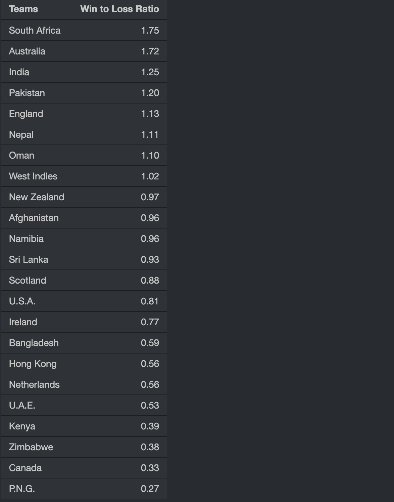

## 1. Introduction

### 1.1 About Cricket

What is the first thing that comes to your mind when you hear, see the word "CRICKET"?

We probably think about cricket match so we decided to make a a shiny app that takes two teams and gives us the result of the match .

### 1.2 Project Motivation & Objective

We are motivated by the craze of cricket , World Cup are going on and we see the match and thought come in mind that what happen if in a team one or two player are changed , what will be the probablity of winning , So based of previous data we decided to make a function that will do our job .

### 1.3 Questions We Imposed

Here are a few questions laid down by us looking at the dataset:

-   What level of control and customization is available during the match simulation?

-   Can we get a visual representations of data using graphs and chart?

-   Can we filter match history by specific teams, years, or tournaments?

-   Are historical statistics and records available for past World Cup tournaments?

-   Can we view a team's recent performance statistics, such as recent form and trends?

-   What is the correlation between a country's performance and its GDP and its Happiness index?

-   How can we access a summary of each previous encounter between two sides in the app?

-   Is there a feature to watch or re-enact classic matches from the past?

-   Can we find the win-loss ratio for different countries participating in the ODI World Cup?

-   Can we choose between default teams or create a custom team with my favorite players?

## 2. About our Dataset

### 2.1 Source and method of obtaining dataset

We scraped the players data from a website called [Cricmetric](http://www.cricmetric.com/index.py), and Teams data from [Cricinfo](https://www.espncricinfo.com/records/list-of-match-results-by-year-307851).
The GDP per Capital data was initially downloaded from - [kaggle](https://www.kaggle.com/datasets/zgrcemta/world-gdpgdp-gdp-per-capita-and-annual-growths?select=gdp_per_capita.csv). It is cleaned to be used with the dataset collected.
The Happiness Index data was downloaded from - [kaggle](https://www.kaggle.com/datasets/simonaasm/world-happiness-index-by-reports-2013-2023/?select=World+Happiness+Index+by+Reports+2013-2023+with+nulls.csv).

### 2.2 Describing datsaset variables

The datasets we obtained was having data of all the ODI cricket player of all the teams that players of had played ODI matches, we selected those player which are playing now because we got the list of player of ODI team of every country that have ODI team.

#### 2.2.1 Categorical Variables

Player_name

:   Contains the name of playes according to country and saved as a list .

Country_name

:   Contains the names of country witch are interested in ODI means have ODI teams and are going to play ODI matched .

All_Player_name

:   Contain same as Player name but in different manner this have player name in simple way means as a vector .

#### 2.2.2 Numerical Variables

All_Player_Data

:   This variable is a list witch contains 147 list whose names are according to Player names and in each list scraped data is stored . We scraph data in form of a tibble and computed probablity of from that and and also a visualsation plot and store all these in a list means in list that is of player name contaion all these three things .

coord

:   Contains the coordinated of world by this we will plot the world map and show some visualisation on it .

gdp

:   This is a data set which have row names as country name and columns have years and have gdp per capita of the country in that year in it.

happy

:   This is a dataset which have row as country name and columns have year, rank and happiness index data in it.

image_links

:   This is a list in this there are 10 list named after country name and in each there are 15 list which have name before player name and in this image ink is stored .

Player_Data

:   Is a list contain the data which is same as All_Player_data but saved according to country names.

table

:   This is a table which contains data of all ODI Matches played, Winner, Loser, Winning Score, Losing Score, Winning Innings, Margin, Ground, Date.

## 3. How did we obtain our dataset? (Scraping it is!)

### 3.1 Libraries we used in this process

-   rvest

-   tidyverse

### 3.2 Problems we faced in this process

The main problem is that when we scrap the player name and in **Crickmetric** website we put a player name and it says no data because there is a spell mistake in the name and on other website same happens with different player name.

The main problem with scraping on **Cricinfo** is that we got the winner, loser, date, ground and margin of each match easily in the form of a table which can be scraped easily, but getting the match scores was a bit more tricky. For good plots, we only consider matches which give a result(No draws or ties).


### 3.3 Solutions we used to tackle the aforementioned issues

So after scraping we cross check the names of a player manually, after getting the correct name we formed the list and makes a function the scrap the data a give input as a player name and takes output the dataset of the past years.
For getting the scores of the teams, we had to go to the link of the scorecard for each match, and scrape that site separately for the match scores.

## 4. Cleaning the Dataset

### 4.1 Libraries we used in this process

-   dplyr

-   stringr

### 4.2 Method, problems and their solutions while cleaning data

#### 4.2.1 Player Data

When we see all payer are now matching with the website player name then after checking 2-3 player name we see the the data which website is showing is in same way so we deside to form a function that will scraph al the data , the cleaning of data will also present in th function , the main problem is that the NA values are generting in cleaning process becouse of some sign , we use gsum , sub , substering, sapply , etc functions to clean the data

#### 4.2.2 Categorizing numeric into category

All the data we get from the website is in formet of character so we convert all the data in numeric category . so that we can use it in visualisation .

#### 4.2.3 Functions that are user defined and used in scraping

#### 4.2.3.1 Scrap_Bowling_data(Player name)

This function takes the player name and then from web site scrap the data and clean it and also calculationg the probability of Bowler players to take witcket and also visulaise the data and combine in a list and give this list as output.

#### 4.2.3.1 Scrap_Bating_data(Player name)

This function takes the player name and then from web site scrap the data and clean it and also calculating the proability of players to hit runs and also visualise the data and combine in a list and give this list as output.

#### 4.2.4 Function to get ODI Data for a particular team

We use the function team_filter(team_name) to filter out the ODI Matches played by that team, and it gives out the scores made by that team, the opponent, winner, loser, scores made by the winner, the loser, match date, ground, and margin of victory.

## 5. Cricket Function that simulated the match :

This function takes four input two are player name and two are player data , based of probability of players the results are calculated, this is the code :

```{r}
#| echo: true
#| eval: true
#| warning: false


Cricket_Match <- function(Team_Data_1 , Team_Data_2,Team_name_1,Team_name_2){
# here will make a function that will semulates a cricket match 
  
{  
  ball <- NULL          # defing ball as null to get values in it 
  
  for(i in 1:11){         
  # for i in 1:11 means there are 11 players in a team but will select 5 best bowlers 
    tryCatch({
      ball[i] <- Team_Data_2[[i]]$Bowling[[1]]
    }, error=function(e){})
  }
  ball[is.na(ball)] <- 0
  
  bowler_seq <- NULL
  for ( i in 1:5){
    bowler_seq[i] <- which(ball == max(ball), arr.ind = TRUE)[1]
    ball[bowler_seq[i]] <- 0
  }
  
  
  
  
  Baller_name <- NULL         
  # defining some variable that we will use in the function 
  Ball_runs <- NULL
  B_wicket <- NULL
  
  Order <- rep(bowler_seq,10)      
  # this sequence is make to define the order of bowling 
   
  
  batsman_name <- NULL
  Batsman_6 <- NULL
  Batsman_4 <- NULL
  batsman_run <- NULL
  batsman_outer <- NULL
  
  
  
  Runs <- 0
  Ind <- 1
  
  for(i in 1:50){            
    # i is the no of ovwers here that will be 50 and it will take one by one all 
    # the values 
    
    if(Ind == 11){
      break                 
      # this is for when 10 player got out and 11 player came to bets that 
      #the match will be over and so we beak the loop at 11
    }
    over <- NULL           # this will bw used to take data of oveers in it 
    
    
    Or <- Order[i]
    
    Wicket <- 0
    
    
    for(j in 1:6){       
      # here j is the no of ball in  a over 
      if(Ind == 11){         
        # this is also same when 11 player come to bet the loop will break
        # and function will stop so that match will stop 
        break
      }
      # We defined the values zero so that is this variable in function not
      # take any value then NA will not come zero will come if it takes value that 
      # it will be replaced
      batsman_run[6*(i-1) + j] <- 0        
      Batsman_6[6*(i-1) + j] <- 0
      Batsman_4[6*(i-1) + j] <- 0
      # here we take a sample of out or not on based of probablities that
      # we calculated by data that was scraped
      Sam <- sample(c("Out","Not_Out"),1,replace = TRUE,prob = 
                      c(Team_Data_2[[Or]]$Bowling[[1]],
                        1-Team_Data_2[[Or]]$Bowling[[1]]))     
     
       # what if player will not out obeviously it will hit some runs or zero can 
      # be there
       if(Sam == "Not_Out"){              
      #   print(Team_Data_1[[Ind]]$Batting[[1]])
        # this is the sample witch is based of players probablity to hit runs  
         # according to previoud data
        Run <- sample(c(0,1,2,3,4,6),1,replace = TRUE,prob = 
                        Team_Data_1[[Ind]]$Batting[[1]])     
          
        
         Runs <- Runs + Run
        over[j] <- Run                      ##### here we will store the values in
        #variables
        batsman_name[6*(i-1) + j] <- Team_name_1[Ind]
        batsman_run[6*(i-1) + j] <- Run
        # we know when there are 1 or 3 run strike changes that we have done here
        if(Run == 1 || Run == 3){             
          
          
          nam <- Team_name_1[Ind]
          nam_ <- Team_name_1[Ind + 1]
          Team_name_1[Ind + 1] <- nam
          Team_name_1[Ind] <- nam_
          
          
          
          Runner <- Team_Data_1[[Ind]]$Batting              
          Facer <-Team_Data_1[[Ind +1]]$Batting
          Team_Data_1[[Ind+1]]$Batting <- Runner
          Team_Data_1[[Ind]]$Batting <- Facer
          
        }
        
        
        if (Run == 4){                    # if 4 runs we will store it in a  
          # variable 
          Batsman_4[6*(i-1)+j] <- 1
        }
        
        
        if (Run == 6){                       # this is for 6
          Batsman_6[6*(i-1)+j] <- 1
        } 
        
        
        
      } 
      
      else {
        
        batsman_name[6*(i-1) + j] <- Team_name_1[Ind]  
        # what if player got out       # here we store wicket and bowlers name
        batsman_outer[6*(i-1)+j] <- Team_name_2[Or]
        Ind <- Ind + 1
        Wicket <- Wicket + 1
        over[j] <- 0
      }
      if (j == 6 ){         
        # this is the last ball of the over,strike will change so we do it here 
        
        nam <- Team_name_1[Ind]
        nam_ <- Team_name_1[Ind + 1]
        Team_name_1[Ind + 1] <- nam
        Team_name_1[Ind] <- nam_
        
        
        B_wicket[i] <- Wicket
        Baller_name[i] <- Team_name_2[Or]
        Ball_runs[i] <- sum(over)
        
        Runner <- Team_Data_1[[Ind]]$Batting
        Facer <-Team_Data_1[[Ind +1]]$Batting
        Team_Data_1[[Ind+1]]$Batting <- Runner
        Team_Data_1[[Ind]]$Batting <- Facer
        
        # Over_Data[[i]] <- Over
      }
        
        
     }
      
      
      
      
    }
    
    baller_data <- tibble(Baller_name, Ball_runs,B_wicket )        
    # here we make tibble of all the data that a got from above loops 
    baller_data <- baller_data %>%                                 
      # here we arrange then in a useful way 
      group_by(Baller_name) %>%
      summarise(Runs = sum(Ball_runs),
                Wicket = sum(B_wicket)) %>%
      arrange(desc(Wicket))
  
  
    batsman_data <- tibble( batsman_name, Batsman_6 ,Batsman_4,batsman_run )
    batsman_data <- batsman_data %>%                               
      # this is of batsman data 
      group_by(batsman_name) %>%
      summarise(six = sum(Batsman_6),
                four = sum(Batsman_4),
                Runs = sum(batsman_run))
  
    batsman_outer <- as.vector(na.omit(batsman_outer))
    len <- dim(batsman_data)[1]                               
    # some na are introduced so we removed them 
    
    if( length(batsman_outer) != len){
      for ( i in {length(batsman_outer) + 1}:len){
        batsman_outer[i] <- "Not Out"
      }
    }
    batsman_data$batsman_outer <- batsman_outer
    
    
    
    team_1_run <- sum(batsman_data$Runs)          
    # savinf all useful thing in a list so we can take them in a return 
    team_2_wicket <- sum(baller_data$Wicket)
    
    output_1 <- list(length(2))
    output_1[[1]] <- batsman_data
    output_1[[2]] <- baller_data
  }
  #####################
  # Team 2 Bats                                   
  # here, the same process for inning 2  so i will skip 
  ####################
 
}
```

## 5.0 Visualising the Dataset

### 5.1 Libraries we used in this process

-   ggplot2

-   imager

-   rvest

-   ggpubr

-   ggthemes

-   tidyverse

-   reshape2

### 5.2 Generating plot with the help of user defined functions

#### 5.2.1 Function: All_Player_data$...$....\$[[3]]

In this plot there are two coloured bars , rech are marked in right side of plot anyone can easily understand, the text on red coloured bar is of strike rate in that year and text on blue coloured bar shows the rate that player out means in 1 inning what will be the probablity of player to br out is there.

#### 5.2.2 Function: imager(link of image )

This function plot the image of the player by using the link .

### 5.3 Shiny app

The Shiny App made by our group had the following features:

-   ODI Player data tab in this tab viewer have to give input as a country name and player name and player data will be shown

    

-   ODI team data tab by selection the year viewer can see the relevant output in the side as a tibble as a plot and visualisation also .

    {width="400"}

-   Match tab In this tab player have to select the team based on that output will be generated by using the ***Cricket_Match*** and viewer can also define a new team by selecting new team .

    

### 5.4 Generating visualisations using our Shiny App

#### 5.4.1 A bar plot shows the player data

```{r,echo=FALSE,warning=FALSE,message=FALSE}

  library(dplyr)

library(ggplot2)

library(shiny)

library(shinydashboard)

library(shinyWidgets)

library(tidyr)

library(googleVis)

library(DT)

library(dashboardthemes)

library(GGally)

# library(ggplot)

library(imager)

library(plotly)

library(rvest)

library(ggthemes)

library(ggpubr)

library(ggwordcloud)

# install.packages("ggplot")

library(reshape2)

library(ggvenn)

library(treemap)

library(ggrepel)
# Loading the required datasets

load("../Data Sets/Cricket.RData")
load("../Data Sets/Teams_Table.RData")
load("../Data Sets/Cricket_Coord.RData")
happy <- read.csv("../Data Sets/Happiness_Index.csv")
gdp <- read.csv("../Data Sets/gdp_per_capita.csv")

# A year function to find the year in the Date Format.

year <- function(da) {
  return(as.integer(format(da, "%Y")))
}


Data <- Player_Data$India$`Virat Kohli`$Batting[[2]]
 Main <- Data %>%
    select(Year ,Runs ,Balls, Innings , Outs) %>%
    summarise(Year = Year ,
              Rate = round({Runs/Balls}*6, 2),
              Runs_per_Inning =Runs/Innings  , 
              Balls_per_Inning = Balls/Innings,
              Not_Out_Rate = {Innings-Outs}/Innings)
  
  xy <- Main[,c(1,3,4)]
  xy <- melt(xy,"Year")
  text <- Main$Rate
  text <- append(text,Main$Not_Out_Rate)
  text <- round(text,3)
  Data5 <- tibble(xy,text)
  ggp <- ggplot(Data5 , aes(x = Year , y = value , fill = variable )) + 
    geom_bar(stat = "identity", width = 0.5,position = position_dodge(width = 0.7)) + 
    geom_text(aes(label=text), vjust=1.5, colour="black", size=3) +
    labs(x = "Years" , y = "Number of Balls Or Runs ", title =paste0(name,"'s Performance") )
ggp + theme(axis.text.x = element_text(angle = 30))


```

In this plot x axis shows the no of year , y axis shows the number of balls or baised on bar means for red bar it is run and for skyblue bar its ball , no the text on red bar are strike rate and on skyblue bar is the probablity to be out in a inning .


#### 5.4.2 World Map Plot

```{r,echo=FALSE,eval=TRUE}


teams <- unique(table$Loser)[c(1:6, 8:19, 24:28)]
W_L <- NULL
t <- table %>% filter((year(`Match Date`) >= 1971) & (year(`Match Date`) <= 2023))

# Calculates Win to Loss Ratio.

for (i in 1:length(teams)) {
  win <- sum(t$Winner == teams[i])
  loss <- sum(t$Loser == teams[i])
  if (loss == 0) {
    W_L <- append(W_L, NA)
  }
  else {
    W_L <- append(W_L, win/loss)
  }
}
WL <- data.frame(teams, W_L)
data <- left_join(coord, WL, by = "teams")
ggplot(data, aes(x = long, y = lat, group = group)) +
  geom_polygon(aes(fill = W_L), color = "black")
```

This plot shows the win loss ratio of the team colour coded on map and density of colour shows the win to loss ratio.

#### 5.4.3 Match Up Plot

```{r,echo=FALSE,eval=TRUE}
y1 <- 1971
y2 <- 2023
t1 <- "Australia"
t2 <- "England"
tf <- team_filter(t1)
tab <- tf %>%
  filter((as.integer(year(tf$'Match Date')) <= y2) & (as.integer(year(tf$'Match Date')) >= y1)) %>%
  filter(Opponent == t2)
Date <- NULL
Score <- NULL
Team <- NULL
    
for (i in 1:length(tab$Winner)) {
  if (tab$Winner[i] == t1) {
    Date <- append(Date, tab$'Match Date'[i])
    Date <- append(Date, tab$'Match Date'[i])
    Score <- append(Score, tab$Winner_Score[i])
    Score <- append(Score, tab$Loser_Score[i])
    Team <- append(Team, t1)
    Team <- append(Team, t2)
  }
  if (tab$Winner[i] == t2) {
    Date <- append(Date, tab$'Match Date'[i])
    Date <- append(Date, tab$'Match Date'[i])
    Score <- append(Score, tab$Loser_Score[i])
    Score <- append(Score, tab$Winner_Score[i])
    Team <- append(Team, t1)
    Team <- append(Team, t2)
  }
}
t <- data.frame(Date, Score, Team)
ggplot(t, aes(x = Date, y = Score, col = Team)) + geom_point()
```

This plot shows the result of previous year matches. x axis is the year and y axis shows the score and red and blue points are for different country.


#### 5.4.4 Happiness Index

##### 5.4.4.1 Happiness Index Correlation Barplot

```{r echo = FALSE}
Countries <- c("Australia", "Pakistan", "New Zealand", "India", "Sri Lanka", "Zimbabwe", "Bangladesh", "South Africa", "Netherlands", "Kenya", "Ireland", "Afghanistan")
Correlation <- NULL
for (c in Countries) {
  tab <- happy %>% filter(Country == c)
  Tf <- team_filter(c)
  y_team <- unique(year(Tf$'Match Date'))
  Year <- NULL
  for (i in unique(tab$Year)) {
    if (i %in% unique(year(Tf$'Match Date'))) {
      Year <- append(Year, i)
    }
  }
  Happiness <- NULL
  Win_To_Loss <- NULL
  for (i in Year) {
    hap <- tab$Index[which(tab$Year == i, arr.ind = TRUE)]
    Happiness <- append(Happiness, as.double(hap))
    Win <- length((Tf %>% filter(Winner == c) %>% filter(year(`Match Date`) == i))$Winner)
    Loss <- length((Tf %>% filter(Loser == c) %>% filter(year(`Match Date`) == i))$Loser)
    if (Loss == 0) {
      Win_To_Loss <- append(Win_To_Loss, Win)
    }
    else {
      Win_To_Loss <- append(Win_To_Loss, Win/Loss)
    }
  }
  Correlation <- append(Correlation, cor(Win_To_Loss, Happiness))
}
barplot(names = Countries, height = Correlation, xlab = "Countries", ylab = "Correlation")
```

This plot shows the correlation of Happiness Index with the Win to Loss Ratio of the countries selected. x axis is the country, and y axis is the correlation.

##### 5.4.4.2 Country Specific View

```{R echo = FALSE}

#| echo: false
#| eval: true
#| warning: false 


y1 <- happy %>% filter(Country == "India")
y2 <- team_filter("India")
Year <- NULL
for (i in unique(y1$Year)) {
  if (i %in% unique(year(y2$'Match Date'))) {
    Year <- append(Year, i)
  }
}
Win_To_Loss <- NULL
Happiness <- NULL
for (i in Year) {
  hap <- y1$Index[which(y1$Year == i, arr.ind = TRUE)]
  Happiness <- append(Happiness, as.double(hap))
  Win <- length((y2 %>% filter(Winner == "India") %>%
                   filter(year(`Match Date`) == i))$Winner)
  Loss <- length((y2 %>% filter(Loser == "India") %>% 
                    filter(year(`Match Date`) == i))$Loser)
  if (Loss == 0) {
    Win_To_Loss <- append(Win_To_Loss, Win)
  }
  else {
    Win_To_Loss <- append(Win_To_Loss, Win/Loss)
  }
}
matplot(Year, cbind(Happiness, Win_To_Loss), col = c("red", "blue"),
        pch = c(13, 16), xlab = "Year", 
        ylab = "Happiness Index + Win To Loss Ratio")
legend("topright", legend = c("Happiness Index", "Win To Loss Ratio"), 
       col = c("red", "blue"), pch = c(13, 16))

```

This plot shows the variation of Happiness Index and Win to Loss Ratio with year, of the selected country, India in this case.


####  5.4.5 GDP

##### 5.4.5.1 GDP Correlation Barplot

```{R echo = FALSE}

#| echo: false
#| eval: true
#| warning: FALSE

Countries <- c("Australia", "Pakistan", "New Zealand", "India", "Sri Lanka",
  "Zimbabwe", "Bangladesh", "South Africa", "Netherlands", "Kenya", "Ireland",
  "Afghanistan")
Correlation <- NULL
# For each country, it finds out GDP of each year, and win to loss ratio,
# and finds the correlation of the data.
for (c in Countries) {
  tab <- gdp %>% filter(Country.Name == c)
  Tf <- team_filter(c)
  y_team <- unique(year(Tf$'Match Date'))
  Years <- NULL
  for (i in 1960:2020) {
    if (!is.na(tab[i - 1957] == "NA") & (as.integer(i) %in% y_team)) {
      Years <- append(Years, as.integer(i))
    }
  }
  GDP <- NULL
  Win_To_Loss <- NULL
  for (i in Years) {
    GDP <- append(GDP, as.integer(tab[i - 1957]))
    Win <- length((Tf %>% filter(Winner == c) %>%
                     filter(year(`Match Date`) == i))$Winner)
    Loss <- length((Tf %>% filter(Loser == c) %>%
                      filter(year(`Match Date`) == i))$Loser)
    if (Loss == 0) {
      Win_To_Loss <- append(Win_To_Loss, Win)
    }
    else {
      Win_To_Loss <- append(Win_To_Loss, Win/Loss)
    }
  }
  Correlation <- append(Correlation, cor(Win_To_Loss, GDP))
}
barplot(names = Countries, height = Correlation, xlab = "Countries",
        ylab = "Correlation")
```

This plot shows the correlation of GDP with the Win to Loss Ratio of the countries selected. x axis is the country, and y axis is the correlation.

##### 5.5.5.2 Country Specific View
```{r echo = FALSE}
    t1 <- "India"
    tab <- gdp %>% filter(Country.Name == t1)
    Tf <- team_filter(t1)
    y_team <- unique(year(Tf$'Match Date'))
    Years <- NULL
    for (i in 1960:2020) {
      if (!is.na(tab[i - 1957] == "NA") & (as.integer(i) %in% y_team)) {
        Years <- append(Years, as.integer(i))
      }
    }
    GDP <- NULL
    Win_To_Loss <- NULL
    for (i in Years) {
      GDP <- append(GDP, as.integer(tab[i - 1957]))
      Win <- length((Tf %>% filter(Winner == t1) %>% filter(year(`Match Date`) == i))$Winner)
      Loss <- length((Tf %>% filter(Loser == t1) %>% filter(year(`Match Date`) == i))$Loser)
      if (Loss == 0) {
        Win_To_Loss <- append(Win_To_Loss, Win)
      }
      else {
        Win_To_Loss <- append(Win_To_Loss, Win/Loss)
      }
    }
    matplot(Years, cbind(GDP, 1000*Win_To_Loss), col = c("red", "blue"), pch = c(13, 16), xlab = "Years", ylab = "GDP + Win To Loss Ratio(x 1000)")
    legend("topright", legend = c("GDP per Capita", "Win To Loss Ratio(x 1000)"), col = c("red", "blue"), pch = c(13, 16))
```

This plot shows the variation of GDP and Win to Loss Ratio with year, of the selected country, India in this case.


#### 5.4.6 A plotly shoing batsman data

```{r,echo=FALSE,eval=TRUE}
data <- Cricket_Match(Player_Data$Afghanistan,Player_Data$India,
                      Player_name$Afghanistan,Player_name$India)
 p <-  ggplot(data[[1]][[1]], aes(x = batsman_name, y = Runs,
                                  col = factor(four), size = six , 
                                  shape = batsman_outer)) + 
        geom_point() + 
        labs(title ="Batsman Performance" ,x = "Batsman Name", y = "Total Runs", 
             shape = "Wicketeer", color = "No of Four", size = "No of Six") +
        theme(axis.text.x = element_text(angle = 45, 
                                         hjust = 1),legend.position = "none")
 ggplotly(p, tooltip = c("batsman_name", "Runs", "four", "six", "batsman_outer"))

```

This plot shows the result of batsman as visualisation x bar shows the name of player and y bar shows the total run hit by a player shape shows who has taken the wicket , color shows no of Four, size shows No of Six. This plot is in plotly but in pdf cant be shown so to see described plot please refer to html document .


#### 5.4.7 A pie plot showing bowler data in match

```{r , echo=FALSE,eval=TRUE}
 ggplot(data[[1]][[2]], aes(x = "", y = Runs, fill = Baller_name)) +
        geom_bar(width = 1, stat = "identity", color = "black") +
        geom_text(aes(label = paste(Baller_name, "\n", "Wickets:",
                                    Wicket,"\n","Runs:" , Runs)), 
                  position = position_stack(vjust = 0.5), size = 3,
                  vjust = 1, color = "white") +
        coord_polar("y") +
        theme_minimal() +  # Change the theme to minimal
        theme(
          legend.position = "none",
          axis.text.x = element_blank(),  # Remove x-axis text
          panel.grid = element_blank(),   # Remove grid lines
          plot.background = element_rect(fill = "lightblue"), 
          # Change plot background color
          panel.background = element_rect(fill = "white"),    
          # Change panel background color
          axis.line = element_line(color = "black"),           
          # Add a border around the plot
          plot.title = element_text(hjust = 0.5, size = 16),   
          # Center the title and increase font size
          axis.title = element_text(size = 1),               
          # Increase axis label font size
          axis.text.y = element_text(size = 10)    )            
# Increase y-axis text font size

```

This pie plot shows the bowlers outcome in a match all detail are described in it .


## 6. Conclusions

Access to individual player information throughout their career is a fantastic feature, especially for cricket fans who want to dig deep into player statistics and achievements. This can improve the overall cricketing experience. The ability to run live simulations with default teams or custom lineups is an appealing feature. It allows users to test strategies, create dream teams, and experience the excitement of live matches within the app. Displaying win-loss ratios for different countries in the ODI World Cup adds a competitive element to the app. Users can compare their customized team's performance to that of real-world national teams. Being capable to access summaries of previous encounters between two sides provides historical context. It allows users to research rivalries and historical events in cricket. Viewing a team's past performance, along with graphs, is a useful feature for those interested in in-depth analysis. It enables users to make data-driven decisions and understand team trends. It's interesting to see the correlation between GDP per capita, Happiness Index, and win-loss ratios of World Cup countries. It gives the app an educational and analytical dimension, appealing to users who are interested in the broader societal impact on sports performance.

## 7. References

-   Players Dataset scraped from [Cricmetic](http://www.cricmetric.com/index.py)

-   Teams Data scraped from [Cricinfo](https://www.espncricinfo.com/records/list-of-match-results-by-year-307851).

-   Happiness Index data downloaded from [Kaggle](https://www.kaggle.com/datasets/simonaasm/world-happiness-index-by-reports-2013-2023/?select=World+Happiness+Index+by+Reports+2013-2023+with+nulls.csv).

-   GDP per Capita data downloaded from [Kaggle](https://www.kaggle.com/datasets/zgrcemta/world-gdpgdp-gdp-per-capita-and-annual-growths?select=gdp_per_capita.csv).

-   [R documentation](https://www.r-project.org/other-docs.html) was very useful for finding functions in base R.
